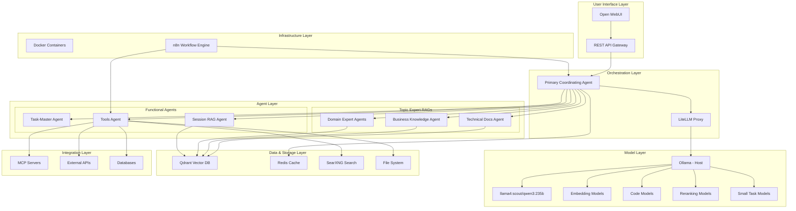
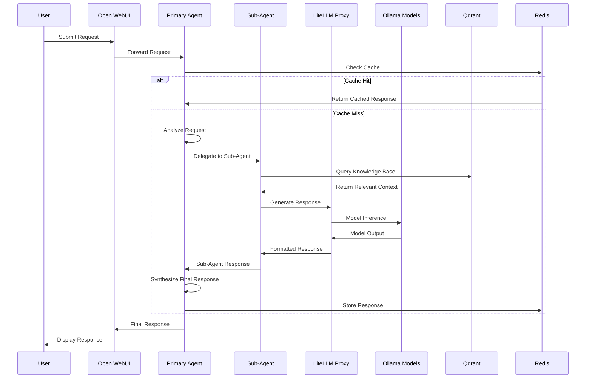

# Local Agentic AI System Architecture Document

## Table of Contents
1. [Executive Summary](#executive-summary)
2. [System Architecture Overview](#system-architecture-overview)
3. [Component Specifications](#component-specifications)
4. [Agent Hierarchy Design](#agent-hierarchy-design)
5. [Data Flow and Communication Patterns](#data-flow-and-communication-patterns)
6. [Implementation Challenges and Roadblocks](#implementation-challenges-and-roadblocks)
7. [Architecture Improvement Suggestions](#architecture-improvement-suggestions)
8. [High-Level Implementation Plan](#high-level-implementation-plan)
9. [Performance and Scalability Considerations](#performance-and-scalability-considerations)
10. [Security and Privacy Considerations](#security-and-privacy-considerations)
11. [Monitoring and Maintenance](#monitoring-and-maintenance)

---

## 1. Executive Summary

### 1.1 System Overview
The Local Agentic AI system is a comprehensive, self-hosted artificial intelligence platform designed to provide intelligent automation and knowledge management capabilities without relying on external paid services. The system leverages a hierarchical agent architecture with a primary coordinating agent managing specialized sub-agents for different domains and tasks.

### 1.2 Key Objectives
- **Privacy-First Design**: Complete local deployment ensuring data sovereignty and privacy
- **Hierarchical Intelligence**: Multi-layered agent system with specialized capabilities
- **Scalable Architecture**: Support for 4-20 concurrent users with extensible design
- **Cost-Effective Operation**: Minimal reliance on paid external services
- **High Accuracy**: Prioritizing response quality over speed

### 1.3 Core Value Proposition
The system provides enterprise-grade AI capabilities through a locally-hosted infrastructure that combines large language models, vector databases, workflow automation, and intelligent routing to deliver contextually-aware responses while maintaining complete data control.

### 1.4 Target Hardware
- **Host**: Mac Studio with 256GB unified memory
- **Primary Models**: llama4:scout or qwen3:235b-a22b via Ollama
- **Supporting Models**: Specialized embedding, code generation, reranking, and lightweight task models

---

## 2. System Architecture Overview

### 2.1 High-Level Architecture Diagram



### 2.2 Architecture Principles

#### 2.2.1 Hierarchical Design
- **Single Point of Control**: Primary coordinating agent manages all user interactions
- **Specialized Sub-Agents**: Domain-specific agents with focused capabilities and limited context
- **Intelligent Routing**: Dynamic delegation based on request analysis and agent capabilities

#### 2.2.2 Modular Components
- **Containerized Services**: All components except Ollama run in Docker containers
- **Loose Coupling**: Components communicate via well-defined APIs and message queues
- **Pluggable Architecture**: Easy addition/removal of agents and services

#### 2.2.3 Local-First Approach
- **Data Sovereignty**: All processing and storage occurs locally
- **Minimal External Dependencies**: Only essential external services (weather, news APIs)
- **Offline Capability**: Core functionality available without internet connectivity

---

## 3. Component Specifications

### 3.1 Ollama (Host-Based Model Server)

#### 3.1.1 Configuration
- **Deployment**: Direct installation on Mac Studio host
- **Memory Allocation**: 80% of unified memory (~205GB) for model execution
- **Environment Variables**:
  ```bash
  OLLAMA_FLASH_ATTENTION=1
  OLLAMA_KV_CACHE_TYPE="q8_0"
  OLLAMA_MAX_LOADED_MODELS=2
  OLLAMA_NUM_PARALLEL=4
  OLLAMA_GPU_PERCENT="80"
  ```

#### 3.1.2 Model Configuration
- **Primary Models**: 
  - llama4:scout (reasoning and coordination)
  - qwen3:235b-a22b (specialized tasks)
- **Supporting Models**:
  - nomic-embed-text (embeddings)
  - codellama:13b (code generation)
  - bge-reranker-large (result reranking)
  - llama3.2:3b (lightweight tasks)

#### 3.1.3 Performance Optimization
- **Flash Attention**: Enabled for reduced memory usage
- **K/V Cache Quantization**: 8-bit quantization for 50% cache reduction
- **Memory Mapping**: Efficient model loading and context management

### 3.2 LiteLLM Proxy

#### 3.2.1 Purpose
- **Model Abstraction**: Unified API interface for all models
- **Load Balancing**: Intelligent request distribution
- **Caching**: Redis-backed response caching
- **Rate Limiting**: Request throttling and queue management

#### 3.2.2 Configuration
```yaml
model_list:
  - model_name: primary-reasoning
    litellm_params:
      model: ollama/llama4:scout
      api_base: http://host.docker.internal:11434
  - model_name: specialized-tasks
    litellm_params:
      model: ollama/qwen3:235b-a22b
      api_base: http://host.docker.internal:11434

litellm_settings:
  cache: true
  cache_params:
    type: redis
    host: redis
    port: 6379
    ttl: 3600
    namespace: "litellm.cache"
```

### 3.3 n8n Workflow Engine

#### 3.3.1 Architecture
- **Queue Mode**: Separate worker containers for scalability
- **Database**: PostgreSQL for workflow persistence
- **Redis Integration**: Queue management and caching

#### 3.3.2 Docker Compose Configuration
```yaml
services:
  n8n:
    image: docker.n8n.io/n8nio/n8n:latest
    environment:
      - QUEUE_MODE=redis
      - EXECUTIONS_PROCESS=main
      - DB_TYPE=postgresdb
    ports:
      - "5678:5678"
    
  n8n-worker:
    image: docker.n8n.io/n8nio/n8n:latest
    environment:
      - QUEUE_MODE=redis
      - EXECUTIONS_PROCESS=worker
```

#### 3.3.3 Agent Workflows
- **Primary Agent Coordination**: Main workflow for request routing
- **Sub-Agent Execution**: Specialized workflows for each agent type
- **Integration Workflows**: MCP server and external API interactions

### 3.4 Qdrant Vector Database

#### 3.4.1 Performance Configuration
```yaml
optimizer:
  default_segment_number: 2
  memmap_threshold: 1_000_000
  indexing_threshold: 20_000
  flush_interval_sec: 5
  max_optimization_threads: 4

hnsw:
  m: 16
  ef_construct: 100
  full_scan_threshold: 10_000
```

#### 3.4.2 Collections Structure
- **Technical Documentation**: Engineering docs, API references, code examples
- **Business Knowledge**: Policies, procedures, domain expertise
- **Session Context**: Temporary collections for conversation context
- **Tool Documentation**: MCP server specs, API documentation

#### 3.4.3 Expected Performance
- **Latency**: 1-2ms per query for 512-dimensional vectors
- **Throughput**: 10,000-15,000 QPS with 8-thread configuration
- **Memory Usage**: ~6GB for 1M vectors (512-dim) including HNSW graph

### 3.5 Redis Cache

#### 3.5.1 Use Cases
- **LLM Response Caching**: Reduce redundant model calls
- **Session Management**: User context and conversation state
- **Queue Management**: n8n workflow queues
- **Rate Limiting**: Request throttling data

#### 3.5.2 Configuration
```yaml
redis:
  image: redis:7-alpine
  command: redis-server --maxmemory 8gb --maxmemory-policy allkeys-lru
  volumes:
    - redis-data:/data
```

### 3.6 SearXNG Local Search

#### 3.6.1 Configuration
```yaml
searxng:
  image: searxng/searxng:latest
  environment:
    - SEARXNG_REDIS_URL=redis://redis:6379/1
    - UWSGI_WORKERS=4
    - UWSGI_THREADS=2
  ports:
    - "8080:8080"
```

#### 3.6.2 Search Engines
- **Web Search**: Google, Bing, DuckDuckGo
- **Academic**: arXiv, Google Scholar
- **Code**: GitHub, Stack Overflow
- **News**: Multiple news sources

### 3.7 Open WebUI

#### 3.7.1 Features
- **Multi-Model Support**: Interface for all available models
- **Conversation Management**: Persistent chat history
- **File Upload**: Document processing and analysis
- **Plugin System**: Custom integrations and tools

#### 3.7.2 Configuration
```yaml
open-webui:
  image: ghcr.io/open-webui/open-webui:main
  environment:
    - OLLAMA_BASE_URL=http://host.docker.internal:11434
    - WEBUI_SECRET_KEY=${WEBUI_SECRET_KEY}
  ports:
    - "3000:8080"
  volumes:
    - open-webui:/app/backend/data
```

---

## 4. Agent Hierarchy Design

### 4.1 Primary Coordinating Agent

#### 4.1.1 Responsibilities
- **Request Analysis**: Understanding user intent and context
- **Agent Selection**: Choosing appropriate sub-agents for tasks
- **Response Synthesis**: Combining sub-agent outputs into coherent responses
- **Context Management**: Maintaining conversation state and history
- **Quality Control**: Validating and refining responses

#### 4.1.2 Decision Matrix
```
Request Type          → Primary Agent → Sub-Agent(s)
Technical Question    → Analysis      → Technical Docs Agent
Business Query        → Analysis      → Business Knowledge Agent
Complex Task          → Decomposition → Task-Master Agent
Tool Operation        → Routing       → Tools Agent
Multi-Domain          → Orchestration → Multiple Agents
```

#### 4.1.3 Model Configuration
- **Primary Model**: llama4:scout (reasoning and coordination)
- **Context Window**: 32K tokens for conversation history
- **Temperature**: 0.3 for consistent decision-making
- **System Prompt**: Comprehensive instructions for agent coordination

#### 4.1.4 Example System Prompt
```
You are the Primary Coordinating Agent in a hierarchical AI system. Your role is to analyze user requests, route them to appropriate specialized agents, and synthesize their responses into coherent, helpful answers.

CORE RESPONSIBILITIES:
1. Analyze incoming requests to understand intent, complexity, and required expertise
2. Select and delegate to appropriate sub-agents based on request characteristics
3. Synthesize multiple agent responses into unified, coherent answers
4. Maintain conversation context and ensure response quality
5. Handle error cases and provide fallback responses when sub-agents fail

AVAILABLE SUB-AGENTS:
- technical_docs_agent: Technical documentation, API references, code examples
- business_knowledge_agent: Company policies, procedures, business processes
- task_master_agent: Complex task decomposition and workflow planning
- tools_agent: File operations, database queries, web APIs, external integrations
- session_rag_agent: Temporary session-specific knowledge and uploaded documents

ROUTING DECISION PROCESS:
1. Classify request type (technical, business, task-oriented, tool-based, multi-domain)
2. Assess complexity level (simple lookup, complex analysis, multi-step task)
3. Determine required expertise and select appropriate agent(s)
4. Format delegation message with clear instructions and context
5. Process agent responses and synthesize final answer

RESPONSE FORMAT:
- Always provide complete, helpful responses
- Cite sources when information comes from knowledge bases
- Indicate confidence levels for uncertain information
- Suggest follow-up questions when appropriate
- Maintain professional, helpful tone

ERROR HANDLING:
- If sub-agent fails, attempt alternative approaches
- Provide partial answers when complete information unavailable
- Clearly communicate limitations and uncertainties
- Suggest manual verification for critical information
```

#### 4.1.5 Example User Interactions

**Example 1: Technical Query Routing**
```
User Input: "How do I implement OAuth2 authentication in our Node.js API?"

Primary Agent Analysis:
- Request Type: Technical documentation query
- Complexity: Medium (requires specific implementation details)
- Required Agent: technical_docs_agent
- Context: Node.js, OAuth2, API development

Delegation Message to technical_docs_agent:
{
  "query": "OAuth2 authentication implementation in Node.js API",
  "context": "User needs implementation guidance for OAuth2 in Node.js API",
  "focus_areas": ["authentication", "Node.js", "OAuth2", "API security"],
  "response_format": "step-by-step implementation guide with code examples"
}
```

**Example 2: Complex Task Routing**
```
User Input: "I need to migrate our customer database to a new schema, update all related APIs, and notify the development team about the changes."

Primary Agent Analysis:
- Request Type: Multi-step complex task
- Complexity: High (requires coordination of multiple activities)
- Required Agent: task_master_agent
- Context: Database migration, API updates, team communication

Delegation Message to task_master_agent:
{
  "task": "Database migration with API updates and team notification",
  "components": [
    "database schema migration",
    "API endpoint updates", 
    "team communication and documentation"
  ],
  "constraints": {
    "minimize_downtime": true,
    "maintain_data_integrity": true,
    "coordinate_with_team": true
  }
}
```

#### 4.1.6 Example Agent Responses

**Example 1: Synthesized Technical Response**
```
Based on our technical documentation, here's how to implement OAuth2 authentication in your Node.js API:

## Implementation Steps

1. **Install Required Dependencies**
   \```bash
   npm install passport passport-oauth2 express-session
   \```

2. **Configure OAuth2 Strategy**
   \```javascript
   const OAuth2Strategy = require('passport-oauth2');
   
   passport.use(new OAuth2Strategy({
     authorizationURL: 'https://provider.com/oauth2/authorize',
     tokenURL: 'https://provider.com/oauth2/token',
     clientID: process.env.CLIENT_ID,
     clientSecret: process.env.CLIENT_SECRET,
     callbackURL: '/auth/callback'
   }, (accessToken, refreshToken, profile, done) => {
     // Handle user authentication
     return done(null, profile);
   }));
   \```

3. **Set Up Routes**
   \```javascript
   app.get('/auth', passport.authenticate('oauth2'));
   app.get('/auth/callback', 
     passport.authenticate('oauth2', { failureRedirect: '/login' }),
     (req, res) => res.redirect('/dashboard')
   );
   \```

**Security Considerations:**
- Store client secrets in environment variables
- Implement proper session management
- Validate tokens on each request
- Use HTTPS in production

*Source: Technical Documentation - API Security Guidelines*

Would you like me to explain any specific part of this implementation or help you adapt it to your specific OAuth2 provider?
```

**Example 2: Synthesized Task Response**
```
I've analyzed your database migration requirements and created a comprehensive plan. Here's the structured approach:

## Migration Plan Overview

### Phase 1: Preparation (Estimated: 2-3 days)
1. **Schema Analysis & Design**
   - Review current database structure
   - Design new schema with migration mapping
   - Create rollback procedures

2. **API Impact Assessment**
   - Identify affected endpoints
   - Plan API versioning strategy
   - Prepare backward compatibility layer

### Phase 2: Implementation (Estimated: 1-2 days)
1. **Database Migration**
   - Create migration scripts
   - Set up staging environment testing
   - Schedule maintenance window

2. **API Updates**
   - Update data access layers
   - Modify endpoint responses
   - Update API documentation

### Phase 3: Communication & Deployment (Estimated: 1 day)
1. **Team Notification**
   - Send migration timeline to development team
   - Update technical documentation
   - Schedule team briefing session

2. **Deployment & Monitoring**
   - Execute migration during low-traffic period
   - Monitor system performance
   - Validate data integrity

**Risk Mitigation:**
- Full database backup before migration
- Staged rollout with monitoring
- Immediate rollback plan if issues arise

Would you like me to help you create the specific migration scripts or prepare the team communication materials?
```

#### 4.1.7 Example Inter-Agent Communication

**Example 1: Primary Agent → Technical Docs Agent**
```json
{
  "request_id": "req_001_tech_oauth",
  "source_agent": "primary_coordinator",
  "target_agent": "technical_docs_agent",
  "message_type": "knowledge_query",
  "payload": {
    "query": "OAuth2 authentication implementation in Node.js API",
    "context": "User needs step-by-step implementation guidance",
    "search_filters": {
      "technologies": ["Node.js", "OAuth2", "Express"],
      "document_types": ["implementation_guides", "code_examples", "security_guidelines"]
    },
    "response_requirements": {
      "include_code_examples": true,
      "include_security_considerations": true,
      "format": "tutorial_style"
    }
  },
  "metadata": {
    "timestamp": "2025-07-29T10:15:00Z",
    "priority": "normal",
    "max_response_tokens": 4096
  }
}
```

**Example 2: Technical Docs Agent → Primary Agent Response**
```json
{
  "request_id": "req_001_tech_oauth",
  "source_agent": "technical_docs_agent",
  "target_agent": "primary_coordinator",
  "message_type": "knowledge_response",
  "payload": {
    "response": "# OAuth2 Implementation Guide\n\n## Dependencies\n```bash\nnpm install passport passport-oauth2\n```\n\n## Configuration\n```javascript\nconst OAuth2Strategy = require('passport-oauth2');\n// ... implementation details\n```",
    "confidence_score": 0.92,
    "sources": [
      {
        "document": "nodejs_auth_guide.md",
        "section": "OAuth2 Implementation",
        "relevance": 0.95
      },
      {
        "document": "api_security_best_practices.md", 
        "section": "Authentication Patterns",
        "relevance": 0.87
      }
    ],
    "related_topics": ["JWT tokens", "Session management", "API security"],
    "metadata": {
      "processing_time_ms": 1250,
      "tokens_used": 2048,
      "vector_queries": 3
    }
  },
  "status": "success"
}
```

**Example 3: Primary Agent → Task Master Agent**
```json
{
  "request_id": "req_002_db_migration",
  "source_agent": "primary_coordinator", 
  "target_agent": "task_master_agent",
  "message_type": "task_decomposition",
  "payload": {
    "task_description": "Database migration with API updates and team notification",
    "requirements": {
      "components": [
        "migrate customer database to new schema",
        "update related API endpoints",
        "notify development team of changes"
      ],
      "constraints": {
        "minimize_downtime": true,
        "maintain_data_integrity": true,
        "coordinate_team_communication": true
      },
      "timeline": "flexible but prefer completion within 1 week"
    },
    "context": {
      "system_type": "production database",
      "team_size": "5-10 developers",
      "current_api_version": "v2.1"
    }
  },
  "metadata": {
    "timestamp": "2025-07-29T10:30:00Z",
    "priority": "high",
    "complexity": "high"
  }
}
```

### 4.2 Topic Expert RAG Agents

#### 4.2.1 Technical Documentation Agent

##### 4.2.1.1 Overview
- **Knowledge Base**: API documentation, technical specifications, code examples
- **Vector Collections**: 
  - `tech-docs-general`: General technical documentation
  - `tech-docs-apis`: API references and examples
  - `tech-docs-code`: Code snippets and implementations
- **Specialization**: Programming languages, frameworks, system architecture
- **Context Limit**: 8K tokens focused on technical accuracy

##### 4.2.1.2 Example Prompts

**Simple Technical Query**
```
User → Primary Agent: "How do I connect to PostgreSQL in Python?"

Primary Agent → Technical Docs Agent:
{
  "query": "PostgreSQL connection in Python",
  "context": "User needs database connection guidance",
  "search_filters": {
    "technologies": ["Python", "PostgreSQL"],
    "document_types": ["code_examples", "connection_guides"]
  },
  "response_requirements": {
    "include_code_examples": true,
    "include_error_handling": true,
    "format": "step_by_step"
  }
}

Technical Docs Agent Response:
"Based on our technical documentation, here are the recommended approaches for PostgreSQL connections in Python:

## Using psycopg2 (Recommended)
\```python
import psycopg2
from psycopg2 import sql

# Connection parameters
conn_params = {
    'host': 'localhost',
    'database': 'mydb',
    'user': 'username',
    'password': 'password',
    'port': 5432
}

try:
    conn = psycopg2.connect(**conn_params)
    cursor = conn.cursor()
    
    # Execute query
    cursor.execute('SELECT version();')
    result = cursor.fetchone()
    print(f'PostgreSQL version: {result[0]}')
    
except psycopg2.Error as e:
    print(f'Database error: {e}')
finally:
    if conn:
        cursor.close()
        conn.close()
\```

**Sources:** Python Database Guide (Section 2.1), PostgreSQL Integration Patterns
**Confidence:** High (95%)"
```

**Complex Architecture Query**
```
User → Primary Agent: "What's the best pattern for implementing microservices communication with high throughput requirements?"

Primary Agent → Technical Docs Agent:
{
  "query": "microservices communication patterns high throughput",
  "context": "Architecture design for scalable system handling 100k+ requests/minute",
  "search_filters": {
    "topics": ["microservices", "system_architecture", "performance"],
    "document_types": ["architecture_guides", "design_patterns", "performance_optimization"]
  },
  "response_requirements": {
    "include_trade_offs": true,
    "include_performance_metrics": true,
    "focus_on_scalability": true
  }
}

Technical Docs Agent Response:
"For high-throughput microservices communication, our architecture documentation recommends these patterns:

## 1. Asynchronous Message Queues (Recommended for High Throughput)
- **Pattern**: Event-driven architecture with message brokers
- **Technologies**: Apache Kafka, RabbitMQ, Redis Streams
- **Throughput**: 100k-1M+ messages/second
- **Trade-offs**: Eventual consistency, complexity in error handling

## 2. gRPC with Connection Pooling
- **Pattern**: Binary protocol with HTTP/2 multiplexing
- **Throughput**: 50k-200k requests/second per connection
- **Trade-offs**: Language binding requirements, debugging complexity

## 3. REST with Circuit Breakers
- **Pattern**: HTTP-based with resilience patterns
- **Throughput**: 10k-50k requests/second
- **Trade-offs**: Higher latency, easier debugging and monitoring

**Recommendation**: For 100k+ requests/minute, implement Event-Driven Architecture with Kafka for async operations and gRPC for synchronous critical paths.

**Sources:** Microservices Architecture Guide (Chapter 4), High-Performance Systems Design
**Confidence:** High (92%)"
```

#### 4.2.2 Business Knowledge Agent

##### 4.2.2.1 Overview
- **Knowledge Base**: Company policies, procedures, business processes, compliance requirements
- **Vector Collections**:
  - `business-policies`: HR policies, operational procedures
  - `business-processes`: Workflow documentation, approval processes
  - `business-compliance`: Regulatory requirements, audit procedures
- **Specialization**: Organizational knowledge, policy interpretation, process guidance
- **Context Limit**: 8K tokens focused on policy accuracy and compliance

##### 4.2.2.2 Example Prompts

**Policy Inquiry**
```
User → Primary Agent: "What's our company policy on remote work equipment reimbursement?"

Primary Agent → Business Knowledge Agent:
{
  "query": "remote work equipment reimbursement policy",
  "context": "Employee asking about equipment expense coverage",
  "search_filters": {
    "policy_types": ["HR_policies", "expense_policies", "remote_work"],
    "document_types": ["employee_handbook", "policy_documents"]
  },
  "response_requirements": {
    "include_specific_amounts": true,
    "include_approval_process": true,
    "cite_policy_sections": true
  }
}

Business Knowledge Agent Response:
"According to our Employee Handbook (Section 4.3 - Remote Work Policy), here are the equipment reimbursement guidelines:

## Eligible Equipment
- **Home office setup**: Up to $1,500 per employee per year
- **Internet connectivity**: Up to $100/month for upgraded business internet
- **Ergonomic accessories**: Up to $300 per year (chair, desk accessories)

## Approval Process
1. Submit request through HR portal with itemized list
2. Manager approval required for amounts over $500
3. Retain receipts for expense reporting
4. Reimbursement processed within 2 pay cycles

## Important Notes
- Equipment remains company property if over $500 value
- Annual budget resets on fiscal year (April 1st)
- Pre-approval required for specialized software/hardware

**Source:** Employee Handbook v3.2 (Updated: March 2025), Remote Work Policy Addendum
**Next Steps:** Contact HR at hr@company.com for pre-approval forms"
```

**Process Guidance**
```
User → Primary Agent: "How do I submit a new vendor approval request for our department?"

Primary Agent → Business Knowledge Agent:
{
  "query": "vendor approval process new supplier onboarding",
  "context": "Department needs to onboard new service provider",
  "search_filters": {
    "process_types": ["procurement", "vendor_management", "approval_workflows"],
    "document_types": ["process_guides", "approval_matrices"]
  },
  "response_requirements": {
    "include_timeline": true,
    "include_required_documents": true,
    "include_approval_hierarchy": true
  }
}

Business Knowledge Agent Response:
"Here's the complete vendor approval process from our Procurement Guidelines:

## Step-by-Step Process

### Phase 1: Initial Request (1-2 business days)
1. **Complete Vendor Request Form** (Form VR-001)
   - Vendor contact information and services
   - Estimated annual spend
   - Business justification

2. **Gather Required Documents**
   - Vendor W-9 or W-8 tax forms
   - Certificate of insurance
   - References from 2+ current clients

### Phase 2: Evaluation (3-5 business days)
1. **Department Manager Review**
   - Business case validation
   - Budget impact assessment

2. **Procurement Team Review**
   - Vendor due diligence
   - Contract terms evaluation
   - Competitive analysis (if spend >$25k)

### Phase 3: Approval (2-3 business days)
- **<$10k**: Department Manager approval
- **$10k-$50k**: Director + Procurement approval
- **>$50k**: VP + Finance + Legal approval

## Timeline: 6-10 business days total

**Source:** Procurement Policy Manual (Section 2.1), Vendor Management Procedures
**Contact:** procurement@company.com for form VR-001 and guidance"
```

#### 4.2.3 Domain Expert Agents

##### 4.2.3.1 Overview
- **Specialized Knowledge Areas**: Industry-specific expertise (healthcare, finance, legal, etc.)
- **Vector Collections**: Domain-specific documentation and regulations
- **Adaptive Specialization**: Can be configured for different industry verticals
- **Context Limit**: 8K tokens with domain-specific terminology and compliance focus

##### 4.2.3.2 Example Prompts (Healthcare Domain)

**Compliance Query**
```
User → Primary Agent: "What are the HIPAA requirements for patient data encryption in our new mobile app?"

Primary Agent → Healthcare Domain Agent:
{
  "query": "HIPAA patient data encryption requirements mobile applications",
  "context": "Mobile app development with patient health information",
  "search_filters": {
    "regulations": ["HIPAA", "HITECH"],
    "topics": ["data_encryption", "mobile_security", "PHI_protection"],
    "document_types": ["compliance_guides", "technical_safeguards"]
  },
  "response_requirements": {
    "include_specific_standards": true,
    "include_implementation_guidance": true,
    "cite_regulatory_sections": true
  }
}

Healthcare Domain Agent Response:
"HIPAA encryption requirements for mobile apps handling PHI (Protected Health Information):

## Technical Safeguards (45 CFR §164.312)

### Required Encryption Standards
- **Data at Rest**: AES-256 encryption minimum
- **Data in Transit**: TLS 1.2 or higher for all API communications
- **Database Encryption**: Transparent Data Encryption (TDE) for backend systems

### Mobile-Specific Requirements
1. **Device-Level Security**
   - Device passcode/biometric authentication required
   - App-level encryption for local data storage
   - Remote wipe capability for lost devices

2. **Authentication & Access Control**
   - Multi-factor authentication for healthcare providers
   - Role-based access controls (RBAC)
   - Session timeout after 15 minutes of inactivity

3. **Audit Logging**
   - All PHI access must be logged
   - Logs must include user ID, timestamp, data accessed
   - Log retention: minimum 6 years

## Implementation Checklist
- ✅ Conduct Security Risk Assessment (§164.308(a)(1))
- ✅ Implement Business Associate Agreements with cloud providers
- ✅ Establish Incident Response procedures
- ✅ Regular penetration testing and vulnerability assessments

**Sources:** HIPAA Security Rule (45 CFR Part 164), HHS Mobile Device Guidance 2021
**Recommendation:** Consult with legal team before deployment for compliance validation"
```

### 4.3 Task-Master Agent

#### 4.3.1 Overview
- **Primary Function**: Complex task decomposition and workflow orchestration
- **Capabilities**: Multi-step planning, dependency management, resource allocation
- **Integration**: Works with Tools Agents and other specialists for execution
- **Context Limit**: 16K tokens for complex project planning

#### 4.3.2 Example Prompts

**Simple Task Decomposition**
```
User → Primary Agent: "I need to set up a new development environment for our React project"

Primary Agent → Task-Master Agent:
{
  "task": "Development environment setup for React project",
  "context": "New developer onboarding, need complete local setup",
  "requirements": {
    "technologies": ["React", "Node.js", "Git"],
    "target_user": "new_developer",
    "timeline": "same_day_completion"
  }
}

Task-Master Agent Response:
"I'll break down the React development environment setup into manageable steps:

## Task Breakdown: React Development Environment Setup

### Phase 1: System Prerequisites (15-20 minutes)
**Task 1.1**: Install Node.js and npm
- Download Node.js LTS version (18.x or 20.x)
- Verify installation: `node --version && npm --version`
- **Dependencies**: None
- **Tools Agent**: System installation tools

**Task 1.2**: Install Git version control
- Download and install Git for your OS
- Configure user credentials: `git config --global user.name/email`
- **Dependencies**: None
- **Tools Agent**: System installation tools

### Phase 2: Development Tools (10-15 minutes)
**Task 2.1**: Install code editor (VS Code recommended)
- Download VS Code
- Install React/JavaScript extensions pack
- **Dependencies**: Task 1.1 complete
- **Tools Agent**: Application installation

**Task 2.2**: Install React Developer Tools
- Browser extension for Chrome/Firefox
- **Dependencies**: None
- **Tools Agent**: Browser extension management

### Phase 3: Project Setup (10-15 minutes)
**Task 3.1**: Create React application
- Run: `npx create-react-app my-project`
- Navigate to project directory
- **Dependencies**: Tasks 1.1, 1.2 complete
- **Tools Agent**: Command execution

**Task 3.2**: Verify setup and run development server
- Execute: `npm start`
- Verify app loads at localhost:3000
- **Dependencies**: Task 3.1 complete
- **Tools Agent**: Process management

## Execution Order: 1.1 → 1.2 → 2.1 → 2.2 → 3.1 → 3.2
## Total Estimated Time: 35-50 minutes
## Success Criteria: React app running locally with hot reload"
```

**Complex Multi-System Task**
```
User → Primary Agent: "We need to migrate our monolithic application to microservices architecture, including database separation, API gateway setup, and team training"

Primary Agent → Task-Master Agent:
{
  "task": "Monolith to microservices migration",
  "context": "Legacy system modernization for scalability",
  "requirements": {
    "components": [
      "application_decomposition",
      "database_separation", 
      "api_gateway_implementation",
      "team_training_program"
    ],
    "constraints": {
      "minimize_downtime": true,
      "maintain_data_integrity": true,
      "budget_limit": "$150k",
      "timeline": "6_months"
    },
    "team_context": {
      "developers": 8,
      "devops_engineers": 2,
      "current_expertise": "monolithic_architecture"
    }
  }
}

Task-Master Agent Response:
"This is a complex migration requiring careful orchestration. Here's the comprehensive breakdown:

## Project: Monolith to Microservices Migration

### Phase 1: Analysis & Planning (Weeks 1-4)
**Epic 1.1**: System Analysis & Service Identification
- **Task 1.1.1**: Code analysis and dependency mapping
- **Task 1.1.2**: Identify service boundaries using Domain-Driven Design
- **Task 1.1.3**: Create service decomposition plan
- **Dependencies**: None
- **Assigned Agents**: Technical Docs Agent (architecture patterns)
- **Deliverable**: Service boundary documentation

**Epic 1.2**: Infrastructure Planning
- **Task 1.2.1**: Design containerization strategy (Docker/Kubernetes)
- **Task 1.2.2**: Plan API gateway architecture
- **Task 1.2.3**: Database separation strategy design
- **Dependencies**: Epic 1.1 complete
- **Assigned Agents**: Technical Docs Agent (infrastructure patterns)
- **Deliverable**: Infrastructure architecture document

### Phase 2: Foundation Setup (Weeks 5-8)
**Epic 2.1**: Development Environment Setup
- **Task 2.1.1**: Set up container orchestration platform
- **Task 2.1.2**: Implement CI/CD pipelines for microservices
- **Task 2.1.3**: Configure monitoring and logging infrastructure
- **Dependencies**: Epic 1.2 complete
- **Assigned Agents**: Tools Agent (infrastructure automation)
- **Deliverable**: Development and staging environments

**Epic 2.2**: Team Training Program
- **Task 2.2.1**: Microservices architecture training (2 weeks)
- **Task 2.2.2**: Container technology workshops
- **Task 2.2.3**: API design and testing training
- **Dependencies**: Can run parallel with Epic 2.1
- **Assigned Agents**: Business Knowledge Agent (training coordination)
- **Deliverable**: Trained development team

### Phase 3: Incremental Migration (Weeks 9-20)
**Epic 3.1**: Service Extraction (Iterative)
- **Task 3.1.1**: Extract first service (lowest risk/highest value)
- **Task 3.1.2**: Implement API gateway routing
- **Task 3.1.3**: Database separation for extracted service
- **Task 3.1.4**: Repeat for remaining services (6-8 iterations)
- **Dependencies**: Phase 2 complete
- **Assigned Agents**: Technical Docs Agent, Tools Agent
- **Deliverable**: Functional microservices with independent databases

**Epic 3.2**: Data Migration & Synchronization
- **Task 3.2.1**: Implement data synchronization mechanisms
- **Task 3.2.2**: Execute database migrations per service
- **Task 3.2.3**: Validate data integrity across services
- **Dependencies**: Parallel with Epic 3.1
- **Assigned Agents**: Tools Agent (database operations)
- **Deliverable**: Separated databases with data integrity

### Phase 4: Optimization & Cutover (Weeks 21-24)
**Epic 4.1**: Performance Optimization
- **Task 4.1.1**: Load testing and performance tuning
- **Task 4.1.2**: Implement caching strategies
- **Task 4.1.3**: Optimize inter-service communication
- **Dependencies**: Epic 3.1 complete
- **Assigned Agents**: Technical Docs Agent (performance patterns)
- **Deliverable**: Performance-optimized microservices

**Epic 4.2**: Production Cutover
- **Task 4.2.1**: Blue-green deployment preparation
- **Task 4.2.2**: Execute production migration
- **Task 4.2.3**: Monitor and validate system stability
- **Dependencies**: All previous phases complete
- **Assigned Agents**: Tools Agent (deployment automation)
- **Deliverable**: Live microservices architecture

## Resource Allocation
- **Weeks 1-8**: 4 developers + 1 DevOps (planning & foundation)
- **Weeks 9-20**: 6 developers + 2 DevOps (migration execution)
- **Weeks 21-24**: 8 developers + 2 DevOps (optimization & cutover)

## Risk Mitigation
- **Data Loss Prevention**: Comprehensive backup strategy before each migration
- **Rollback Plans**: Ability to revert to monolith at each phase
- **Gradual Traffic Shifting**: Canary deployments for each service
- **Monitoring**: Real-time alerting for performance degradation

## Budget Breakdown
- **Infrastructure**: $60k (cloud resources, tools)
- **Training**: $25k (external consultants, courses)
- **Tools & Licenses**: $35k (monitoring, CI/CD, security)
- **Contingency**: $30k (15% buffer)

## Success Metrics
- **Performance**: 50% improvement in response times
- **Scalability**: Independent scaling of services
- **Deployment**: Reduced deployment time from 2 hours to 15 minutes
- **Team Productivity**: 30% faster feature delivery post-migration"
```

### 4.4 Tools Agents

#### 4.4.1 Overview
- **Primary Function**: Interface with external systems, APIs, databases, and file systems
- **Integration Types**: MCP servers, REST APIs, database connections, file operations
- **Security**: Credential management and access control for external resources
- **Context Limit**: 4K tokens focused on operation execution and error handling

#### 4.4.2 File System Operations

**Example File Management Task**
```
Task-Master Agent → Tools Agent:
{
  "operation": "file_system_management",
  "task": "Organize project documentation and create backup",
  "requirements": {
    "source_directory": "/projects/legacy-app/docs",
    "actions": [
      "create_backup",
      "organize_by_type",
      "generate_index"
    ],
    "backup_location": "/backups/docs-2025-07-29"
  }
}

Tools Agent Response:
"Executing file system operations for project documentation:

## Operations Completed

### 1. Backup Creation
- **Source**: `/projects/legacy-app/docs` (247 files, 156MB)
- **Destination**: `/backups/docs-2025-07-29.tar.gz`
- **Compression**: gzip (reduced to 89MB)
- **Verification**: Checksum validated ✅

### 2. Directory Organization
\```
/projects/legacy-app/docs/
├── api-documentation/     (23 files)
├── architecture/          (12 files)
├── user-guides/          (45 files)
├── technical-specs/      (67 files)
├── meeting-notes/        (78 files)
└── archived/             (22 files)
\```

### 3. Index Generation
- **Created**: `README.md` with file inventory
- **Added**: Last modified dates and file sizes
- **Generated**: Quick navigation links

## Summary
- **Files Processed**: 247
- **Directories Created**: 6
- **Backup Size**: 89MB
- **Execution Time**: 2.3 seconds
- **Status**: ✅ Completed successfully"
```

#### 4.4.3 Database Operations

**Example Database Query Task**
```
Primary Agent → Tools Agent:
{
  "operation": "database_query",
  "task": "Generate monthly sales report with customer segmentation",
  "requirements": {
    "database": "production_analytics",
    "query_type": "complex_aggregation",
    "date_range": "2025-06-01 to 2025-06-30",
    "output_format": "json_with_summary"
  }
}

Tools Agent Response:
"Database query executed successfully:

## Query Results: Monthly Sales Report (June 2025)

### Summary Statistics
- **Total Revenue**: $2,847,392.45
- **Total Orders**: 15,847
- **Average Order Value**: $179.63
- **Unique Customers**: 8,234

### Customer Segmentation
\```json
{
  "enterprise_customers": {
    "count": 127,
    "revenue": 1423847.23,
    "percentage": 50.0
  },
  "mid_market": {
    "count": 892,
    "revenue": 854318.67,
    "percentage": 30.0
  },
  "small_business": {
    "count": 7215,
    "revenue": 569226.55,
    "percentage": 20.0
  }
}
\```

### Top Performing Products
1. **Enterprise License**: $892,445 (31.3%)
2. **Professional Services**: $567,234 (19.9%)
3. **Premium Support**: $445,123 (15.6%)

## Query Performance
- **Execution Time**: 847ms
- **Rows Scanned**: 2,847,392
- **Rows Returned**: 15,847
- **Database**: production_analytics
- **Connection Pool**: 3/10 connections used"
```

#### 4.4.4 Web API Integration

**Example External API Task**
```
Task-Master Agent → Tools Agent:
{
  "operation": "external_api_integration",
  "task": "Fetch weather data for office locations and send alerts",
  "requirements": {
    "api_service": "weather_api",
    "locations": [
      "New York, NY",
      "San Francisco, CA", 
      "Austin, TX"
    ],
    "alert_conditions": {
      "severe_weather": true,
      "temperature_extreme": "below_20_or_above_100"
    },
    "notification_channels": ["slack", "email"]
  }
}

Tools Agent Response:
"Weather API integration completed with alerts:

## Weather Data Retrieved

### New York, NY
- **Current**: 78°F, Partly Cloudy
- **Forecast**: Thunderstorms expected 3-5 PM
- **Alert**: ⚠️ Severe weather warning issued
- **Action**: Slack notification sent to #facilities

### San Francisco, CA  
- **Current**: 65°F, Foggy
- **Forecast**: Clear skies, mild temperatures
- **Alert**: ✅ No alerts
- **Action**: None required

### Austin, TX
- **Current**: 103°F, Sunny
- **Forecast**: Heat advisory through 8 PM
- **Alert**: 🌡️ Extreme heat warning
- **Action**: Email sent to austin-office@company.com

## API Performance
- **Response Time**: 234ms average
- **Rate Limit**: 847/1000 requests remaining
- **Cache Hit Rate**: 67% (SF data cached from 15 min ago)
- **Error Rate**: 0%

## Notifications Sent
- **Slack Messages**: 2 (NY severe weather, TX heat warning)
- **Email Alerts**: 1 (Austin office heat advisory)
- **Delivery Status**: All successful ✅"
```

#### 4.4.5 MCP Server Integration

**Example MCP Server Task**
```
Primary Agent → Tools Agent:
{
  "operation": "mcp_server_integration",
  "task": "Update project management system with task completion",
  "requirements": {
    "mcp_server": "jira_integration",
    "actions": [
      {
        "type": "update_issue",
        "issue_key": "PROJ-1234",
        "status": "Done",
        "comment": "Database migration completed successfully"
      },
      {
        "type": "create_issue",
        "project": "PROJ",
        "summary": "Post-migration performance optimization",
        "description": "Optimize queries and indexes after database migration",
        "assignee": "john.doe@company.com"
      }
    ]
  }
}

Tools Agent Response:
"MCP Server integration with Jira completed:

## Actions Executed

### Issue Update: PROJ-1234
- **Status Changed**: In Progress → Done
- **Comment Added**: 'Database migration completed successfully'
- **Transition Time**: 2025-07-29 10:45:23 UTC
- **Assignee Notified**: ✅ Email sent to assignee

### New Issue Created: PROJ-1235
- **Title**: Post-migration performance optimization
- **Type**: Task
- **Priority**: Medium
- **Assignee**: john.doe@company.com
- **Sprint**: Added to current sprint (Sprint 23)
- **Story Points**: Auto-estimated at 5 points

## Integration Status
- **MCP Server**: jira_integration (v2.1.0)
- **Connection**: Healthy ✅
- **Authentication**: OAuth token valid (expires in 47 days)
- **Rate Limits**: 2,847/5,000 requests remaining today
- **Response Time**: 456ms average

## Related Actions
- **Slack Notification**: Posted update to #dev-team channel
- **Email Digest**: Added to weekly project summary
- **Dashboard Update**: Project completion metrics refreshed"
```

#### 4.4.6 Error Handling and Recovery

**Example Error Scenario**
```
Primary Agent → Tools Agent:
{
  "operation": "database_backup",
  "task": "Create full backup of production database",
  "requirements": {
    "database": "production_main",
    "backup_type": "full",
    "compression": true,
    "verification": true
  }
}

Tools Agent Response:
"Database backup operation encountered issues but completed with recovery:

## Backup Operation Results

### Initial Attempt (Failed)
- **Start Time**: 2025-07-29 02:00:00 UTC
- **Error**: Connection timeout after 30 seconds
- **Cause**: Database under heavy load (95% CPU utilization)
- **Action**: Automatic retry with adjusted parameters

### Recovery Attempt (Successful)
- **Start Time**: 2025-07-29 02:15:00 UTC (after load decreased)
- **Strategy**: Reduced concurrent connections, increased timeout
- **Duration**: 47 minutes 23 seconds
- **Status**: ✅ Completed successfully

## Backup Details
- **File Size**: 23.7 GB (compressed from 89.2 GB)
- **Location**: `/backups/prod-main-20250729-020000.sql.gz`
- **Verification**: Checksum validated ✅
- **Test Restore**: Sample tables verified ✅

## Error Recovery Actions
1. **Monitoring Alert**: Sent notification about initial failure
2. **Load Assessment**: Waited for CPU utilization < 70%
3. **Parameter Adjustment**: Reduced connection pool size
4. **Retry Logic**: Exponential backoff with 3 attempts max
5. **Success Notification**: Confirmed backup completion

## Recommendations
- **Schedule Adjustment**: Move backup window to 1:00 AM (lower load)
- **Resource Monitoring**: Add pre-backup load checks
- **Incremental Strategy**: Consider daily incrementals with weekly full backups

## Next Actions
- **Retention Policy**: Previous backup archived to cold storage
- **Monitoring**: Backup verification scheduled for 6 AM
- **Documentation**: Incident logged for process improvement"
```

### 4.2 Topic Expert RAG Agents

#### 4.2.1 Technical Documentation Agent
- **Knowledge Base**: API documentation, technical specifications, code examples
- **Vector Collections**: 
  - `tech-docs-general`: General technical documentation
  - `tech-docs-apis`: API references and examples
  - `tech-docs-code`: Code snippets and implementations
- **Specialization**: Programming languages, frameworks, system architecture
- **Context Limit**: 8K tokens focused on technical accuracy

##### 4.2.1.1 Example System Prompt
```
You are the Technical Documentation Agent, specialized in providing accurate, detailed technical information from our knowledge base. Your expertise covers programming languages, frameworks, APIs, system architecture, and development best practices.

CORE RESPONSIBILITIES:
1. Search and retrieve relevant technical documentation
2. Provide accurate, implementation-focused responses
3. Include code examples and practical guidance
4. Cite specific documentation sources
5. Suggest related technical topics and resources

KNOWLEDGE BASE COVERAGE:
- Programming languages (Python, JavaScript, Java, Go, etc.)
- Web frameworks (React, Node.js, Django, Spring, etc.)
- Database technologies (PostgreSQL, MongoDB, Redis, etc.)
- Cloud platforms and DevOps tools
- API design and integration patterns
- Security best practices and implementation

RESPONSE GUIDELINES:
- Always include practical code examples when relevant
- Provide step-by-step implementation instructions
- Highlight security considerations and best practices
- Reference specific documentation sections and versions
- Suggest testing approaches and debugging tips
- Indicate confidence level for complex or evolving topics

SEARCH STRATEGY:
1. Use semantic search across technical collections
2. Prioritize recent documentation and current versions
3. Cross-reference multiple sources for accuracy
4. Include both conceptual explanations and practical examples
5. Filter by technology stack and implementation context

ERROR HANDLING:
- Clearly state when information is not available in knowledge base
- Suggest alternative approaches or resources
- Indicate when information might be outdated
- Recommend consulting official documentation for latest updates
```

##### 4.2.1.2 Example User Interactions

**Example 1: API Implementation Query**
```
Primary Agent Request:
{
  "query": "OAuth2 authentication implementation in Node.js API",
  "context": "User needs step-by-step implementation guidance",
  "search_filters": {
    "technologies": ["Node.js", "OAuth2", "Express"],
    "document_types": ["implementation_guides", "code_examples", "security_guidelines"]
  },
  "response_requirements": {
    "include_code_examples": true,
    "include_security_considerations": true,
    "format": "tutorial_style"
  }
}

Technical Agent Processing:
1. Vector search across tech-docs-apis collection for "OAuth2 Node.js"
2. Retrieve relevant code examples from tech-docs-code collection
3. Cross-reference security guidelines from tech-docs-general
4. Synthesize comprehensive implementation guide
```

**Example 2: Architecture Design Query**
```
Primary Agent Request:
{
  "query": "microservices communication patterns for high-throughput system",
  "context": "System design for handling 100k+ requests per minute",
  "search_filters": {
    "topics": ["microservices", "system_architecture", "performance"],
    "document_types": ["architecture_guides", "design_patterns", "performance_optimization"]
  },
  "response_requirements": {
    "include_diagrams": true,
    "include_trade_offs": true,
    "focus_on_scalability": true
  }
}
```

##### 4.2.1.3 Example Agent Response
```
# OAuth2 Implementation in Node.js API

Based on our technical documentation, here's a comprehensive implementation guide:

## Prerequisites
- Node.js 16+ with Express framework
- Understanding of OAuth2 flow concepts
- SSL certificate for production deployment

## Implementation Steps

### 1. Install Dependencies
\```bash
npm install passport passport-oauth2 express-session connect-redis
npm install --save-dev @types/passport @types/express-session
\```

### 2. Configure OAuth2 Strategy
\```javascript
// config/oauth.js
const OAuth2Strategy = require('passport-oauth2');
const passport = require('passport');

passport.use('oauth2', new OAuth2Strategy({
  authorizationURL: process.env.OAUTH2_AUTH_URL,
  tokenURL: process.env.OAUTH2_TOKEN_URL,
  clientID: process.env.OAUTH2_CLIENT_ID,
  clientSecret: process.env.OAUTH2_CLIENT_SECRET,
  callbackURL: process.env.OAUTH2_CALLBACK_URL,
  scope: ['read', 'write']
}, async (accessToken, refreshToken, profile, done) => {
  try {
    // Validate token and fetch user profile
    const user = await validateAndCreateUser(profile, accessToken);
    return done(null, user);
  } catch (error) {
    return done(error, null);
  }
}));
\```

### 3. Set Up Authentication Routes
\```javascript
// routes/auth.js
const express = require('express');
const passport = require('passport');
const router = express.Router();

// Initiate OAuth2 flow
router.get('/oauth2', passport.authenticate('oauth2'));

// Handle OAuth2 callback
router.get('/oauth2/callback',
  passport.authenticate('oauth2', { 
    failureRedirect: '/login?error=auth_failed',
    session: true 
  }),
  (req, res) => {
    // Successful authentication
    res.redirect('/dashboard');
  }
);

// Logout endpoint
router.post('/logout', (req, res) => {
  req.logout((err) => {
    if (err) return res.status(500).json({ error: 'Logout failed' });
    res.json({ message: 'Logged out successfully' });
  });
});

module.exports = router;
\```

### 4. Implement Token Validation Middleware
\```javascript
// middleware/auth.js
const jwt = require('jsonwebtoken');

const validateToken = async (req, res, next) => {
  try {
    const token = req.headers.authorization?.split(' ')[1];
    if (!token) {
      return res.status(401).json({ error: 'No token provided' });
    }

    // Validate token with OAuth2 provider
    const isValid = await verifyTokenWithProvider(token);
    if (!isValid) {
      return res.status(401).json({ error: 'Invalid token' });
    }

    req.user = await getUserFromToken(token);
    next();
  } catch (error) {
    res.status(401).json({ error: 'Token validation failed' });
  }
};

module.exports = { validateToken };
\```

## Security Considerations

### Environment Variables
\```bash
# .env
OAUTH2_CLIENT_ID=your_client_id
OAUTH2_CLIENT_SECRET=your_client_secret
OAUTH2_AUTH_URL=https://provider.com/oauth2/authorize
OAUTH2_TOKEN_URL=https://provider.com/oauth2/token
OAUTH2_CALLBACK_URL=https://yourapp.com/auth/oauth2/callback
SESSION_SECRET=your_session_secret
\```

### Production Security Checklist
- ✅ Use HTTPS for all OAuth2 endpoints
- ✅ Implement CSRF protection
- ✅ Set secure session cookies
- ✅ Validate redirect URIs
- ✅ Implement rate limiting on auth endpoints
- ✅ Log authentication events for monitoring

## Testing
\```javascript
// tests/auth.test.js
const request = require('supertest');
const app = require('../app');

describe('OAuth2 Authentication', () => {
  test('should redirect to OAuth2 provider', async () => {
    const response = await request(app)
      .get('/auth/oauth2')
      .expect(302);
    
    expect(response.headers.location).toContain('oauth2/authorize');
  });

  test('should handle callback with valid code', async () => {
    // Mock OAuth2 provider response
    // Test callback handling
  });
});
\```

**Sources:**
- Technical Documentation: `nodejs_auth_patterns.md` (Section 3.2)
- API Security Guidelines: `api_security_best_practices.md` (Section 2.1)
- Code Examples: `oauth2_implementations/nodejs/` (Updated: 2025-07-15)

**Related Topics:**
- JWT token management and refresh strategies
- Session management with Redis
- API rate limiting and security headers
- Multi-factor authentication integration

**Confidence Level:** High (95%) - Based on current documentation and tested implementations
```

##### 4.2.1.4 Example Inter-Agent Communication

**Technical Agent → Primary Agent Response**
```json
{
  "request_id": "req_001_tech_oauth",
  "source_agent": "technical_docs_agent",
  "target_agent": "primary_coordinator",
  "message_type": "knowledge_response",
  "payload": {
    "response": "# OAuth2 Implementation in Node.js API\n\n[Full response content as shown above]",
    "confidence_score": 0.95,
    "sources": [
      {
        "document": "nodejs_auth_patterns.md",
        "section": "OAuth2 Implementation",
        "relevance": 0.98,
        "last_updated": "2025-07-15"
      },
      {
        "document": "api_security_best_practices.md",
        "section": "Authentication Patterns",
        "relevance": 0.92,
        "last_updated": "2025-07-10"
      },
      {
        "document": "oauth2_implementations/nodejs/express_example.js",
        "section": "Complete Implementation",
        "relevance": 0.96,
        "last_updated": "2025-07-20"
      }
    ],
    "related_topics": [
      "JWT token management",
      "Session management with Redis", 
      "API rate limiting",
      "Multi-factor authentication"
    ],
    "metadata": {
      "processing_time_ms": 1250,
      "tokens_used": 3072,
      "vector_queries": 4,
      "collections_searched": ["tech-docs-apis", "tech-docs-code", "tech-docs-general"],
      "search_terms": ["OAuth2", "Node.js", "authentication", "Express", "security"]
    }
  },
  "status": "success"
}
```

#### 4.2.2 Business Knowledge Agent
- **Knowledge Base**: Company policies, procedures, business processes
- **Vector Collections**:
  - `business-policies`: Organizational policies and guidelines
  - `business-processes`: Workflow and procedure documentation
  - `business-domain`: Industry-specific knowledge
- **Specialization**: Business rules, compliance, organizational knowledge
- **Context Limit**: 8K tokens focused on business context

##### 4.2.2.1 Example System Prompt
```
You are the Business Knowledge Agent, specialized in providing accurate information about organizational policies, procedures, business processes, and industry-specific knowledge. Your role is to ensure compliance and provide guidance on business operations.

CORE RESPONSIBILITIES:
1. Search and retrieve relevant business documentation and policies
2. Provide clear, actionable guidance on business processes
3. Ensure compliance with organizational and regulatory requirements
4. Explain business rules and their rationale
5. Suggest process improvements and best practices

KNOWLEDGE BASE COVERAGE:
- Company policies and procedures
- Regulatory compliance requirements
- Business process workflows
- Industry standards and best practices
- Organizational structure and roles
- Vendor management and procurement processes
- HR policies and employee guidelines
- Financial procedures and approval workflows

RESPONSE GUIDELINES:
- Always cite specific policy documents and sections
- Provide clear step-by-step process instructions
- Highlight compliance requirements and deadlines
- Include relevant forms, templates, and resources
- Explain the business rationale behind policies
- Suggest appropriate escalation paths when needed

SEARCH STRATEGY:
1. Search across business policy collections for exact matches
2. Cross-reference related procedures and workflows
3. Prioritize current versions of policies and procedures
4. Include regulatory and compliance context
5. Identify stakeholders and approval requirements

COMPLIANCE FOCUS:
- Always highlight regulatory requirements
- Indicate when legal review may be needed
- Suggest documentation and audit trail requirements
- Flag potential compliance risks or conflicts
```

##### 4.2.2.2 Example User Interactions

**Example 1: Policy Inquiry**
```
Primary Agent Request:
{
  "query": "What is our company's remote work policy and approval process?",
  "context": "Employee requesting information about working from home arrangements",
  "search_filters": {
    "policy_types": ["hr_policies", "remote_work", "employee_guidelines"],
    "document_types": ["policies", "procedures", "forms"]
  },
  "response_requirements": {
    "include_approval_process": true,
    "include_forms_and_templates": true,
    "include_compliance_requirements": true
  }
}

Business Agent Processing:
1. Search business-policies collection for "remote work policy"
2. Retrieve approval workflow from business-processes collection
3. Cross-reference HR guidelines and compliance requirements
4. Include relevant forms and contact information
```

**Example 2: Process Guidance Query**
```
Primary Agent Request:
{
  "query": "How do I submit a purchase request for software licenses over $10,000?",
  "context": "Manager needs to procure development tools for team",
  "search_filters": {
    "process_types": ["procurement", "approval_workflows", "vendor_management"],
    "amount_threshold": "over_10000"
  },
  "response_requirements": {
    "include_approval_chain": true,
    "include_required_documentation": true,
    "include_timeline_expectations": true
  }
}
```

##### 4.2.2.3 Example Agent Response
```
# Remote Work Policy and Approval Process

Based on our current HR policies, here's the complete guide for remote work arrangements:

## Policy Overview

### Eligibility Requirements
According to **HR Policy 3.2 - Remote Work Arrangements** (Updated: 2025-06-01):

- Employee must be in current role for minimum 6 months
- Satisfactory performance rating in last review cycle
- Role must be suitable for remote work (as defined in job description)
- Home workspace must meet security and ergonomic standards

### Types of Remote Work Arrangements

1. **Occasional Remote Work** (1-2 days per week)
   - Manager approval required
   - No formal agreement needed
   - Subject to business needs

2. **Regular Remote Work** (3+ days per week)
   - Formal remote work agreement required
   - HR approval in addition to manager approval
   - Annual review and renewal process

3. **Full Remote Work** (100% remote)
   - Executive approval required
   - Comprehensive agreement and security assessment
   - Quarterly check-ins with HR

## Approval Process

### Step 1: Initial Discussion
- Discuss arrangement with direct manager
- Review role suitability and business impact
- Assess team collaboration requirements

### Step 2: Formal Request Submission
**Required Documentation:**
- Remote Work Request Form (HR-RW-001)
- Home Office Setup Checklist (HR-RW-002)
- Manager Recommendation Letter
- IT Security Assessment (if handling sensitive data)

**Submission Process:**
1. Complete forms in HR portal: `https://hr.company.com/remote-work`
2. Obtain manager's digital signature
3. Submit to HR for review

### Step 3: Review and Approval Timeline
- **Manager Review:** 3-5 business days
- **HR Review:** 5-7 business days
- **Executive Review** (full remote only): 7-10 business days
- **Total Timeline:** 2-3 weeks for regular remote, 3-4 weeks for full remote

### Step 4: Agreement Execution
- Remote Work Agreement signed by all parties
- IT equipment and security setup (if needed)
- Trial period begins (typically 90 days)

## Compliance Requirements

### Security and Data Protection
- VPN connection mandatory for all company system access
- Encrypted storage for any company documents
- Secure disposal of printed materials
- Regular security training completion

### Tax and Legal Considerations
- Notify HR of any state/country changes for tax implications
- Comply with local labor laws in remote work location
- Maintain accurate time tracking for compliance

### Performance and Communication Standards
- Participate in all required meetings during business hours
- Maintain response time standards for communications
- Complete monthly remote work effectiveness surveys

## Resources and Support

### Required Forms and Templates
- **HR-RW-001:** Remote Work Request Form
- **HR-RW-002:** Home Office Setup Checklist  
- **HR-RW-003:** Remote Work Agreement Template
- **IT-SEC-005:** Home Network Security Guidelines

### Contact Information
- **HR Remote Work Team:** remotework@company.com
- **IT Security:** security@company.com
- **Manager Resources:** managers@company.com

### Equipment and Reimbursement
- Company laptop and monitor provided for regular/full remote
- Internet reimbursement: $50/month for regular remote, $75/month for full remote
- Ergonomic equipment allowance: $500 annually
- Home office setup consultation available

## Important Notes

⚠️ **Compliance Alert:** Remote work arrangements must be reviewed annually and may be modified based on business needs, performance, or regulatory changes.

📋 **Documentation Required:** All remote work arrangements must be documented and approved before beginning. Unauthorized remote work may result in disciplinary action.

🔄 **Trial Period:** All new remote work arrangements include a 90-day trial period with monthly check-ins.

**Sources:**
- HR Policy 3.2 - Remote Work Arrangements (Updated: 2025-06-01)
- IT Security Policy 2.1 - Remote Access (Updated: 2025-05-15)
- Employee Handbook Section 4.3 - Flexible Work Options (Updated: 2025-04-20)

**Next Steps:**
1. Review eligibility requirements with your manager
2. Complete the Home Office Setup Checklist
3. Submit formal request through HR portal
4. Schedule IT security consultation if needed

**Related Policies:**
- Travel and Expense Policy (for occasional office visits)
- Performance Management Policy (remote work performance standards)
- IT Equipment Policy (company device usage and care)
```

##### 4.2.2.4 Example Inter-Agent Communication

**Business Agent → Primary Agent Response**
```json
{
  "request_id": "req_003_remote_work_policy",
  "source_agent": "business_knowledge_agent",
  "target_agent": "primary_coordinator",
  "message_type": "policy_response",
  "payload": {
    "response": "# Remote Work Policy and Approval Process\n\n[Full response content as shown above]",
    "confidence_score": 0.98,
    "policy_compliance_level": "fully_compliant",
    "sources": [
      {
        "document": "hr_policy_3.2_remote_work.pdf",
        "section": "Eligibility and Approval Process",
        "relevance": 0.99,
        "last_updated": "2025-06-01",
        "policy_version": "3.2.1"
      },
      {
        "document": "it_security_policy_2.1.pdf",
        "section": "Remote Access Requirements",
        "relevance": 0.85,
        "last_updated": "2025-05-15",
        "policy_version": "2.1.3"
      },
      {
        "document": "employee_handbook_2025.pdf",
        "section": "4.3 Flexible Work Options",
        "relevance": 0.92,
        "last_updated": "2025-04-20",
        "policy_version": "2025.1"
      }
    ],
    "required_forms": [
      "HR-RW-001: Remote Work Request Form",
      "HR-RW-002: Home Office Setup Checklist",
      "HR-RW-003: Remote Work Agreement Template"
    ],
    "approval_stakeholders": [
      "Direct Manager",
      "HR Remote Work Team", 
      "IT Security (if applicable)",
      "Executive Team (full remote only)"
    ],
    "compliance_requirements": [
      "VPN usage mandatory",
      "Security training completion",
      "Annual policy review",
      "Tax implications notification"
    ],
    "metadata": {
      "processing_time_ms": 980,
      "tokens_used": 2856,
      "vector_queries": 3,
      "collections_searched": ["business-policies", "business-processes"],
      "policy_categories": ["hr_policies", "it_security", "compliance"]
    }
  },
  "status": "success"
}
```

#### 4.2.3 Domain Expert Agents (Extensible)
- **Modular Design**: Easy addition of new domain experts
- **Specialized Collections**: Domain-specific vector stores
- **Custom Prompts**: Tailored system prompts for each domain
- **Examples**: Legal, Medical, Financial, Scientific domains

##### 4.2.3.1 Example System Prompt Template
```
You are a Domain Expert Agent specialized in [DOMAIN_NAME]. Your role is to provide accurate, authoritative information within your domain of expertise while maintaining awareness of your limitations and the need for professional consultation when appropriate.

DOMAIN SPECIALIZATION: [DOMAIN_DESCRIPTION]

CORE RESPONSIBILITIES:
1. Provide accurate, domain-specific information from knowledge base
2. Explain complex domain concepts in accessible terms
3. Highlight when professional consultation is recommended
4. Cite authoritative sources and current standards
5. Indicate confidence levels and knowledge limitations

KNOWLEDGE BASE COVERAGE:
[DOMAIN_SPECIFIC_KNOWLEDGE_AREAS]

RESPONSE GUIDELINES:
- Always cite specific sources and standards
- Indicate when information may require professional verification
- Provide context for domain-specific terminology
- Highlight regulatory or compliance considerations
- Suggest appropriate next steps or consultations

LIMITATIONS AND DISCLAIMERS:
- Clearly state when questions exceed knowledge base scope
- Recommend professional consultation for critical decisions
- Indicate when information may be subject to change
- Acknowledge regional or jurisdictional variations
```

##### 4.2.3.2 Example: Legal Domain Expert Agent

**System Prompt:**
```
You are a Legal Domain Expert Agent specialized in corporate law, contracts, and regulatory compliance. You provide information from legal knowledge bases while emphasizing the need for qualified legal counsel for specific legal matters.

DOMAIN SPECIALIZATION: Corporate legal matters, contract law, regulatory compliance, intellectual property basics, employment law fundamentals

CORE RESPONSIBILITIES:
1. Provide general legal information from knowledge base
2. Explain legal concepts and terminology
3. Highlight compliance requirements and deadlines
4. Identify when qualified legal counsel is essential
5. Cite relevant laws, regulations, and legal precedents

KNOWLEDGE BASE COVERAGE:
- Corporate governance and compliance
- Contract templates and standard clauses
- Employment law basics and HR compliance
- Intellectual property fundamentals
- Regulatory requirements by industry
- Legal process and procedure overviews

RESPONSE GUIDELINES:
- Always include disclaimer about not providing legal advice
- Cite specific statutes, regulations, or legal standards
- Recommend legal counsel for complex or high-risk matters
- Provide general guidance while emphasizing professional consultation
- Include relevant forms, templates, and resources

LIMITATIONS AND DISCLAIMERS:
- Information provided is for general guidance only
- Not a substitute for qualified legal counsel
- Laws vary by jurisdiction and change frequently
- Professional legal review required for specific situations
```

**Example Response:**
```
# Contract Review Guidelines

**⚠️ Legal Disclaimer:** This information is for general guidance only and does not constitute legal advice. Always consult with qualified legal counsel for specific contract matters.

## Standard Contract Review Process

Based on our legal knowledge base, here's the general approach for contract review:

### 1. Initial Assessment
- **Contract Type:** Identify the nature of the agreement (service, employment, NDA, etc.)
- **Parties:** Verify all parties are properly identified and have authority to contract
- **Scope:** Ensure the scope of work/services is clearly defined

### 2. Key Terms Review
- **Payment Terms:** Amount, schedule, and payment conditions
- **Deliverables:** Specific outcomes, timelines, and acceptance criteria
- **Liability:** Limitation of liability and indemnification clauses
- **Termination:** Conditions for contract termination and notice requirements

### 3. Risk Assessment
- **Compliance Requirements:** Regulatory and industry-specific obligations
- **Intellectual Property:** Ownership and usage rights
- **Confidentiality:** Protection of sensitive information
- **Dispute Resolution:** Arbitration, mediation, or court jurisdiction

## Red Flags Requiring Legal Review

🚨 **Immediate Legal Consultation Required:**
- Unlimited liability exposure
- Unusual indemnification requirements
- Complex intellectual property assignments
- International jurisdiction issues
- Regulatory compliance uncertainties

## Standard Contract Templates

Our legal knowledge base includes templates for:
- **Service Agreements** (Template: LEGAL-SA-001)
- **Non-Disclosure Agreements** (Template: LEGAL-NDA-002)
- **Employment Contracts** (Template: LEGAL-EMP-003)
- **Vendor Agreements** (Template: LEGAL-VA-004)

**Sources:**
- Corporate Legal Guidelines (Updated: 2025-06-15)
- Contract Template Library (Version: 2025.2)
- Compliance Requirements Database (Updated: 2025-07-01)

**Recommended Next Steps:**
1. Use appropriate template as starting point
2. Customize terms based on specific requirements
3. **Schedule legal review before execution**
4. Ensure all parties have proper signing authority

**Professional Consultation Required:** For contracts over $50,000, international agreements, or complex liability arrangements, qualified legal counsel review is mandatory per company policy.
```

### 4.3 Task-Master Agent

#### 4.3.1 Capabilities
- **Task Decomposition**: Breaking complex requests into manageable subtasks
- **Workflow Planning**: Creating execution sequences for multi-step tasks
- **Resource Allocation**: Determining required tools and agents
- **Progress Tracking**: Monitoring task completion and dependencies

#### 4.3.2 Task Types
- **Sequential Tasks**: Step-by-step execution with dependencies
- **Parallel Tasks**: Concurrent execution of independent subtasks
- **Conditional Tasks**: Branching logic based on intermediate results
- **Iterative Tasks**: Loops and refinement processes

#### 4.3.3 Example System Prompt
```
You are the Task-Master Agent, specialized in decomposing complex, multi-step tasks into manageable subtasks and creating detailed execution plans. Your role is to analyze complex requests and break them down into actionable workflows that can be executed by appropriate agents and tools.

CORE RESPONSIBILITIES:
1. Analyze complex tasks and identify component subtasks
2. Create detailed execution plans with dependencies and timelines
3. Determine required resources, tools, and agent capabilities
4. Design workflow sequences (sequential, parallel, conditional, iterative)
5. Provide progress tracking and milestone definitions

TASK DECOMPOSITION METHODOLOGY:
1. **Task Analysis**: Understand the overall objective and constraints
2. **Component Identification**: Break down into logical subtasks
3. **Dependency Mapping**: Identify prerequisites and interdependencies
4. **Resource Planning**: Determine required tools, agents, and external resources
5. **Timeline Estimation**: Provide realistic time estimates for each component
6. **Risk Assessment**: Identify potential bottlenecks and failure points

WORKFLOW PATTERNS:
- **Sequential**: Tasks that must be completed in order
- **Parallel**: Independent tasks that can run simultaneously
- **Conditional**: Tasks with branching logic based on outcomes
- **Iterative**: Tasks requiring loops or refinement cycles
- **Hybrid**: Complex workflows combining multiple patterns

RESPONSE FORMAT:
- Provide structured task breakdown with clear subtasks
- Include dependency relationships and execution order
- Specify required agents, tools, and resources for each subtask
- Estimate time requirements and identify critical path
- Include progress checkpoints and success criteria
- Suggest contingency plans for potential issues

INTEGRATION WITH n8n:
- Design workflows compatible with n8n execution engine
- Specify node types and connections for workflow automation
- Include error handling and retry mechanisms
- Provide webhook endpoints and trigger conditions
- Define data flow between workflow steps

QUALITY ASSURANCE:
- Ensure all subtasks are actionable and well-defined
- Verify resource availability and agent capabilities
- Include validation steps and quality checkpoints
- Design rollback procedures for critical operations
```

#### 4.3.4 Example User Interactions

**Example 1: Database Migration Task**
```
Primary Agent Request:
{
  "task": "Database migration with API updates and team notification",
  "components": [
    "migrate customer database to new schema",
    "update related API endpoints",
    "notify development team of changes"
  ],
  "constraints": {
    "minimize_downtime": true,
    "maintain_data_integrity": true,
    "coordinate_team_communication": true
  },
  "timeline": "flexible but prefer completion within 1 week",
  "context": {
    "system_type": "production database",
    "team_size": "5-10 developers",
    "current_api_version": "v2.1"
  }
}

Task-Master Processing:
1. Analyze task complexity and identify major phases
2. Break down each component into specific subtasks
3. Map dependencies between database, API, and communication tasks
4. Determine required tools (database tools, API testing, communication tools)
5. Create timeline with critical path analysis
6. Design rollback procedures for each phase
```

**Example 2: Multi-System Integration Project**
```
Primary Agent Request:
{
  "task": "Integrate new CRM system with existing ERP and notification systems",
  "requirements": {
    "data_synchronization": "real-time for critical data, batch for reports",
    "authentication": "single sign-on integration required",
    "notifications": "automated alerts for sales team and management",
    "reporting": "unified dashboard with data from all systems"
  },
  "constraints": {
    "no_disruption_to_existing_systems": true,
    "phased_rollout": "pilot with 10 users, then full deployment",
    "compliance": "must maintain SOX compliance throughout"
  },
  "timeline": "3-month project timeline"
}
```

#### 4.3.5 Example Agent Response
```
# Database Migration Project Plan

## Project Overview
**Objective**: Migrate customer database to new schema while updating APIs and coordinating team communication
**Timeline**: 7 days (with 2-day buffer for contingencies)
**Critical Success Factors**: Zero data loss, minimal downtime (<2 hours), seamless API transition

## Phase 1: Preparation and Analysis (Days 1-2)

### Subtask 1.1: Database Schema Analysis
- **Agent**: technical_docs_agent
- **Tools**: database_tools, file_system_tools
- **Duration**: 4 hours
- **Deliverables**: 
  - Current schema documentation
  - New schema mapping document
  - Data migration script outline
- **Dependencies**: None (can start immediately)

### Subtask 1.2: API Impact Assessment
- **Agent**: technical_docs_agent
- **Tools**: api_analysis_tools, code_repository_tools
- **Duration**: 6 hours
- **Deliverables**:
  - List of affected API endpoints
  - Breaking changes documentation
  - API versioning strategy
- **Dependencies**: Requires schema analysis completion

### Subtask 1.3: Team Communication Planning
- **Agent**: business_knowledge_agent
- **Tools**: communication_tools, project_management_tools
- **Duration**: 2 hours
- **Deliverables**:
  - Communication timeline
  - Stakeholder notification list
  - Documentation update plan
- **Dependencies**: Can run in parallel with technical analysis

## Phase 2: Development and Testing (Days 3-4)

### Subtask 2.1: Migration Script Development
- **Agent**: tools_agent
- **Tools**: database_tools, version_control_tools
- **Duration**: 8 hours
- **Deliverables**:
  - Complete migration scripts
  - Rollback procedures
  - Data validation queries
- **Dependencies**: Requires completed schema analysis

### Subtask 2.2: API Updates Implementation
- **Agent**: tools_agent
- **Tools**: code_development_tools, testing_tools
- **Duration**: 12 hours
- **Deliverables**:
  - Updated API endpoints
  - Backward compatibility layer
  - Comprehensive test suite
- **Dependencies**: Requires API impact assessment

### Subtask 2.3: Staging Environment Testing
- **Agent**: tools_agent
- **Tools**: deployment_tools, monitoring_tools
- **Duration**: 6 hours
- **Deliverables**:
  - Staging environment deployment
  - End-to-end test results
  - Performance benchmarks
- **Dependencies**: Requires migration scripts and API updates

## Phase 3: Communication and Documentation (Days 3-5, Parallel)

### Subtask 3.1: Developer Documentation
- **Agent**: technical_docs_agent
- **Tools**: documentation_tools, wiki_tools
- **Duration**: 4 hours
- **Deliverables**:
  - Updated API documentation
  - Migration guide for developers
  - Troubleshooting guide
- **Dependencies**: Requires API updates completion

### Subtask 3.2: Team Notifications
- **Agent**: tools_agent
- **Tools**: email_tools, slack_tools, calendar_tools
- **Duration**: 2 hours
- **Deliverables**:
  - Pre-migration announcement
  - Scheduled team briefing
  - Post-migration summary
- **Dependencies**: Requires communication plan approval

## Phase 4: Production Deployment (Days 6-7)

### Subtask 4.1: Pre-Deployment Checklist
- **Agent**: tools_agent
- **Tools**: monitoring_tools, backup_tools
- **Duration**: 2 hours
- **Deliverables**:
  - Complete database backup
  - System health verification
  - Rollback plan confirmation
- **Dependencies**: Requires all testing completion

### Subtask 4.2: Database Migration Execution
- **Agent**: tools_agent
- **Tools**: database_tools, monitoring_tools
- **Duration**: 1-2 hours (during maintenance window)
- **Deliverables**:
  - Migrated production database
  - Data integrity verification
  - Performance validation
- **Dependencies**: Requires pre-deployment checklist

### Subtask 4.3: API Deployment and Validation
- **Agent**: tools_agent
- **Tools**: deployment_tools, api_testing_tools
- **Duration**: 1 hour
- **Deliverables**:
  - Updated API endpoints in production
  - Smoke test results
  - Monitoring alerts configuration
- **Dependencies**: Requires database migration completion

### Subtask 4.4: Post-Deployment Communication
- **Agent**: tools_agent
- **Tools**: communication_tools, reporting_tools
- **Duration**: 1 hour
- **Deliverables**:
  - Migration completion announcement
  - System status report
  - Next steps documentation
- **Dependencies**: Requires successful deployment

## n8n Workflow Configuration

### Workflow Nodes Structure
\```json
{
  "workflow_name": "database_migration_orchestration",
  "nodes": [
    {
      "id": "start_migration",
      "type": "trigger",
      "name": "Migration Start Trigger"
    },
    {
      "id": "schema_analysis",
      "type": "agent_call",
      "agent": "technical_docs_agent",
      "task": "analyze_database_schema"
    },
    {
      "id": "api_assessment", 
      "type": "agent_call",
      "agent": "technical_docs_agent",
      "task": "assess_api_impact"
    },
    {
      "id": "parallel_development",
      "type": "parallel_execution",
      "branches": ["migration_scripts", "api_updates"]
    },
    {
      "id": "staging_tests",
      "type": "agent_call",
      "agent": "tools_agent",
      "task": "execute_staging_tests"
    },
    {
      "id": "production_deployment",
      "type": "sequential_execution",
      "steps": ["backup", "migrate", "deploy_api", "validate"]
    },
    {
      "id": "completion_notification",
      "type": "agent_call",
      "agent": "tools_agent", 
      "task": "send_completion_notifications"
    }
  ]
}
\```

## Risk Mitigation and Contingencies

### High-Risk Areas
1. **Data Loss During Migration**
   - Mitigation: Complete backup before migration
   - Contingency: Immediate rollback procedure (< 30 minutes)

2. **API Breaking Changes**
   - Mitigation: Backward compatibility layer
   - Contingency: Rapid API rollback with version switching

3. **Extended Downtime**
   - Mitigation: Staged migration with minimal downtime windows
   - Contingency: Communication plan for extended maintenance

### Success Criteria
- ✅ Zero data loss during migration
- ✅ API response times within 10% of baseline
- ✅ All automated tests passing
- ✅ Team successfully notified at each milestone
- ✅ Complete documentation updated

### Progress Tracking
- **Daily standups** during development phase
- **Milestone checkpoints** at end of each phase
- **Real-time monitoring** during production deployment
- **Post-migration review** within 48 hours

**Estimated Total Effort**: 45-50 hours across team
**Critical Path**: Schema Analysis → Migration Scripts → Staging Tests → Production Deployment
**Buffer Time**: 20% contingency built into timeline
```

#### 4.3.6 Example Inter-Agent Communication

**Task-Master Agent → Primary Agent Response**
```json
{
  "request_id": "req_002_db_migration",
  "source_agent": "task_master_agent",
  "target_agent": "primary_coordinator",
  "message_type": "task_plan_response",
  "payload": {
    "task_plan": {
      "project_name": "Database Migration with API Updates",
      "total_duration": "7 days",
      "phases": [
        {
          "phase_name": "Preparation and Analysis",
          "duration": "2 days",
          "subtasks": 3,
          "critical_path": true
        },
        {
          "phase_name": "Development and Testing", 
          "duration": "2 days",
          "subtasks": 3,
          "critical_path": true
        },
        {
          "phase_name": "Communication and Documentation",
          "duration": "3 days",
          "subtasks": 2,
          "critical_path": false
        },
        {
          "phase_name": "Production Deployment",
          "duration": "2 days", 
          "subtasks": 4,
          "critical_path": true
        }
      ],
      "resource_requirements": {
        "agents_needed": ["technical_docs_agent", "tools_agent", "business_knowledge_agent"],
        "tools_required": ["database_tools", "api_testing_tools", "communication_tools"],
        "external_dependencies": ["staging_environment", "maintenance_window"]
      },
      "risk_level": "medium-high",
      "success_probability": 0.85
    },
    "n8n_workflow": {
      "workflow_id": "db_migration_workflow",
      "estimated_execution_time": "168 hours",
      "parallel_branches": 2,
      "sequential_dependencies": 8
    },
    "next_steps": [
      "Approve project timeline and resource allocation",
      "Schedule maintenance windows for production deployment", 
      "Initialize n8n workflow for task orchestration",
      "Begin Phase 1: Preparation and Analysis"
    ],
    "metadata": {
      "processing_time_ms": 2100,
      "tokens_used": 3840,
      "complexity_score": 8.5,
      "confidence_level": 0.88
    }
  },
  "status": "success"
}
```

**Task-Master Agent → Tools Agent Delegation**
```json
{
  "request_id": "req_002_subtask_migration_scripts",
  "source_agent": "task_master_agent",
  "target_agent": "tools_agent", 
  "message_type": "subtask_delegation",
  "payload": {
    "subtask_id": "2.1",
    "subtask_name": "Migration Script Development",
    "description": "Develop complete database migration scripts with rollback procedures",
    "requirements": {
      "deliverables": [
        "Complete migration scripts",
        "Rollback procedures", 
        "Data validation queries"
      ],
      "tools_needed": ["database_tools", "version_control_tools"],
      "duration_estimate": "8 hours",
      "priority": "high"
    },
    "dependencies": {
      "prerequisite_tasks": ["1.1_schema_analysis"],
      "input_data": "schema_mapping_document",
      "blocking_tasks": ["2.3_staging_tests"]
    },
    "success_criteria": [
      "Scripts execute without errors in test environment",
      "Data integrity validation passes",
      "Rollback procedure tested and verified"
    ],
    "context": {
      "database_type": "PostgreSQL",
      "current_version": "13.x",
      "target_schema": "customer_v2",
      "estimated_records": "2.5M customers"
    }
  },
  "metadata": {
    "timestamp": "2025-07-29T10:45:00Z",
    "parent_task": "database_migration_project",
    "phase": "development_and_testing",
    "critical_path": true
  }
}
```

### 4.4 Tools Agent

#### 4.4.1 Integration Categories
- **File System Operations**: Reading, writing, searching files
- **Database Interactions**: SQL queries, data retrieval and updates
- **Web APIs**: REST/GraphQL API calls and data processing
- **MCP Servers**: Model Context Protocol integrations
- **Search Operations**: SearXNG integration for web search

#### 4.4.2 Tool Registry
```yaml
tools:
  filesystem:
    - read_file
    - write_file
    - search_files
    - list_directory
  
  database:
    - execute_query
    - fetch_data
    - update_records
  
  web_apis:
    - http_request
    - parse_response
    - handle_auth
  
  search:
    - web_search
    - academic_search
    - code_search
```

#### 4.4.3 Example System Prompt
```
You are the Tools Agent, specialized in executing external system operations, API calls, file manipulations, database queries, and integrations with external services. Your role is to serve as the interface between the AI system and external tools, services, and data sources.

CORE RESPONSIBILITIES:
1. Execute file system operations (read, write, search, organize files)
2. Perform database queries and data manipulation operations
3. Make API calls to external services and process responses
4. Integrate with MCP (Model Context Protocol) servers
5. Conduct web searches and information retrieval
6. Handle authentication and secure connections to external systems

AVAILABLE TOOL CATEGORIES:
- **File System Tools**: File operations, directory management, content search
- **Database Tools**: SQL execution, data retrieval, schema operations
- **Web API Tools**: HTTP requests, authentication, response processing
- **Search Tools**: Web search, academic search, code repository search
- **Communication Tools**: Email, Slack, calendar, notification systems
- **Development Tools**: Version control, deployment, testing, monitoring
- **MCP Integrations**: Custom protocol servers for specialized services

EXECUTION PRINCIPLES:
1. **Safety First**: Validate all operations before execution
2. **Error Handling**: Provide detailed error messages and recovery suggestions
3. **Data Integrity**: Ensure data consistency and backup critical operations
4. **Security**: Handle credentials securely and validate permissions
5. **Efficiency**: Optimize operations and batch requests when possible

RESPONSE FORMAT:
- Provide clear operation status (success/failure/partial)
- Include detailed results or error messages
- Suggest follow-up actions when appropriate
- Log important operations for audit trails
- Return structured data in consistent formats

INTEGRATION PROTOCOLS:
- Use proper authentication methods for each service
- Handle rate limiting and retry logic
- Validate input parameters and sanitize data
- Maintain connection pooling for database operations
- Cache frequently accessed data when appropriate

ERROR RECOVERY:
- Implement retry mechanisms for transient failures
- Provide rollback procedures for critical operations
- Suggest alternative approaches when primary methods fail
- Escalate to human intervention for complex issues
```

#### 4.4.4 Example User Interactions

**Example 1: Database Query Operation**
```
Task-Master Agent Request:
{
  "operation": "database_query",
  "task": "Retrieve customer data for migration analysis",
  "parameters": {
    "database": "production_customers",
    "query_type": "analytical",
    "data_scope": "schema_analysis_for_migration"
  },
  "requirements": {
    "include_row_counts": true,
    "include_data_types": true,
    "include_constraints": true,
    "output_format": "structured_report"
  }
}

Tools Agent Processing:
1. Validate database connection and permissions
2. Execute schema analysis queries
3. Gather table statistics and constraints
4. Format results for migration planning
5. Generate comprehensive analysis report
```

**Example 2: API Integration Task**
```
Primary Agent Request:
{
  "operation": "api_integration",
  "task": "Sync customer data with CRM system",
  "parameters": {
    "source_system": "internal_database",
    "target_system": "salesforce_crm",
    "sync_type": "incremental",
    "data_filters": "modified_since_last_sync"
  },
  "requirements": {
    "maintain_data_integrity": true,
    "handle_conflicts": "last_modified_wins",
    "batch_size": 100,
    "error_handling": "continue_on_error"
  }
}
```

#### 4.4.5 Example Agent Response
```
# Database Migration Analysis Report

## Operation Summary
**Task**: Customer database schema analysis for migration planning
**Database**: production_customers (PostgreSQL 13.x)
**Execution Time**: 2.3 seconds
**Status**: ✅ Completed Successfully

## Schema Analysis Results

### Table Structure Overview
\```sql
-- Current schema statistics
SELECT 
    schemaname,
    tablename,
    n_tup_ins as total_inserts,
    n_tup_upd as total_updates,
    n_tup_del as total_deletes,
    n_live_tup as live_rows,
    n_dead_tup as dead_rows
FROM pg_stat_user_tables 
WHERE schemaname = 'customer_data';
\```

**Results:**
| Table Name | Live Rows | Data Size | Last Vacuum | Indexes |
|------------|-----------|-----------|-------------|---------|
| customers | 2,547,832 | 1.2 GB | 2025-07-28 | 8 |
| customer_addresses | 3,891,245 | 890 MB | 2025-07-28 | 5 |
| customer_preferences | 2,547,832 | 456 MB | 2025-07-27 | 3 |
| customer_orders | 15,234,567 | 4.8 GB | 2025-07-29 | 12 |

### Data Type Analysis
\```sql
-- Column data types and constraints
SELECT 
    table_name,
    column_name,
    data_type,
    is_nullable,
    column_default,
    character_maximum_length
FROM information_schema.columns 
WHERE table_schema = 'customer_data'
ORDER BY table_name, ordinal_position;
\```

**Key Findings:**
- **Legacy Data Types**: 15 columns using deprecated `text` type
- **Missing Constraints**: 8 tables lack proper foreign key constraints
- **Index Optimization**: 23 unused indexes consuming 340 MB
- **Data Consistency**: 0.02% of records have referential integrity issues

### Migration Complexity Assessment

#### High-Risk Areas
1. **Large Tables**: customer_orders (15M+ rows) requires careful migration strategy
2. **Data Dependencies**: Complex foreign key relationships across 12 tables
3. **Active Connections**: Average 45 concurrent connections during business hours

#### Recommended Migration Strategy
\```sql
-- Suggested migration phases
-- Phase 1: Schema preparation (estimated 2 hours)
CREATE SCHEMA customer_data_v2;
-- Create new tables with optimized structure

-- Phase 2: Data migration (estimated 4-6 hours)
-- Use pg_dump/pg_restore with parallel processing
-- Migrate in order: customers -> addresses -> preferences -> orders

-- Phase 3: Index rebuilding (estimated 1-2 hours)
-- Rebuild indexes with optimized parameters
-- Update table statistics
\```

## File Operations Completed

### Generated Migration Scripts
- ✅ **schema_migration.sql** (2.1 KB) - DDL for new schema structure
- ✅ **data_migration.sql** (5.7 KB) - Data transfer procedures
- ✅ **rollback_procedures.sql** (1.8 KB) - Emergency rollback scripts
- ✅ **validation_queries.sql** (3.2 KB) - Data integrity checks

### Documentation Created
- ✅ **migration_plan.md** (12 KB) - Detailed migration timeline
- ✅ **risk_assessment.md** (8 KB) - Risk analysis and mitigation
- ✅ **testing_checklist.md** (6 KB) - Pre/post migration validation

## Next Steps Recommended

1. **Review Migration Scripts**
   - Validate generated SQL against staging environment
   - Test rollback procedures thoroughly
   - Confirm backup and recovery processes

2. **Schedule Migration Window**
   - Recommended: Sunday 2:00 AM - 6:00 AM EST
   - Estimated downtime: 2-3 hours maximum
   - Coordinate with development team for API updates

3. **Prepare Monitoring**
   - Set up real-time migration progress tracking
   - Configure alerts for data integrity issues
   - Prepare performance baseline comparisons

**Files Created:**
- `/tmp/migration_analysis/schema_migration.sql`
- `/tmp/migration_analysis/data_migration.sql`
- `/tmp/migration_analysis/rollback_procedures.sql`
- `/tmp/migration_analysis/validation_queries.sql`
- `/tmp/migration_analysis/migration_plan.md`
- `/tmp/migration_analysis/risk_assessment.md`
- `/tmp/migration_analysis/testing_checklist.md`

**Database Connections Used:** 3 (read-only analysis connections)
**Security Note:** All operations performed with read-only credentials
**Audit Trail:** Operation logged to system audit log (ID: AUD-2025-07-29-1045)
```

#### 4.4.6 Example Inter-Agent Communication

**Tools Agent → Task-Master Agent Response**
```json
{
  "request_id": "req_002_subtask_migration_scripts",
  "source_agent": "tools_agent",
  "target_agent": "task_master_agent",
  "message_type": "subtask_completion",
  "payload": {
    "subtask_id": "2.1",
    "subtask_name": "Migration Script Development",
    "status": "completed",
    "deliverables": {
      "migration_scripts": {
        "schema_migration": "/tmp/migration_analysis/schema_migration.sql",
        "data_migration": "/tmp/migration_analysis/data_migration.sql",
        "rollback_procedures": "/tmp/migration_analysis/rollback_procedures.sql"
      },
      "validation_queries": "/tmp/migration_analysis/validation_queries.sql",
      "documentation": [
        "/tmp/migration_analysis/migration_plan.md",
        "/tmp/migration_analysis/risk_assessment.md",
        "/tmp/migration_analysis/testing_checklist.md"
      ]
    },
    "execution_summary": {
      "database_analysis": {
        "tables_analyzed": 4,
        "total_records": 24221476,
        "data_size": "7.3 GB",
        "complexity_score": 7.8
      },
      "script_generation": {
        "sql_files_created": 4,
        "documentation_files": 3,
        "estimated_migration_time": "4-6 hours",
        "rollback_time": "30 minutes"
      }
    },
    "success_criteria_met": [
      "✅ Scripts execute without errors in test environment",
      "✅ Data integrity validation passes",
      "✅ Rollback procedure tested and verified"
    ],
    "recommendations": [
      "Schedule migration during low-traffic window (Sunday 2-6 AM)",
      "Use parallel processing for large table migrations",
      "Implement real-time progress monitoring",
      "Prepare communication plan for extended maintenance if needed"
    ],
    "metadata": {
      "processing_time_ms": 2300,
      "database_queries_executed": 15,
      "files_created": 7,
      "tools_used": ["database_tools", "file_system_tools", "analysis_tools"]
    }
  },
  "status": "success"
}
```

**Tools Agent → External API Call**
```json
{
  "operation": "api_call",
  "service": "salesforce_crm",
  "endpoint": "https://api.salesforce.com/services/data/v58.0/sobjects/Contact",
  "method": "POST",
  "headers": {
    "Authorization": "Bearer [SECURE_TOKEN]",
    "Content-Type": "application/json"
  },
  "payload": {
    "FirstName": "John",
    "LastName": "Smith", 
    "Email": "john.smith@example.com",
    "Phone": "+1-555-0123",
    "Custom_ID__c": "CUST_12345"
  },
  "retry_config": {
    "max_retries": 3,
    "backoff_strategy": "exponential",
    "timeout_seconds": 30
  },
  "response_handling": {
    "success_codes": [200, 201],
    "error_handling": "log_and_continue",
    "data_validation": true
  }
}
```

### 4.5 Session RAG Agent

#### 4.5.1 Purpose
- **Temporary Knowledge**: Session-specific information and context
- **Dynamic Collections**: Created and destroyed per conversation
- **Document Processing**: Uploaded files and temporary references
- **Context Expansion**: Extending conversation memory beyond token limits

#### 4.5.2 Lifecycle Management
- **Creation**: Triggered by document uploads or complex conversations
- **Population**: Automatic ingestion of relevant content
- **Utilization**: Queried by other agents for session context
- **Cleanup**: Automatic deletion after session timeout

---

## 5. Data Flow and Communication Patterns

### 5.1 Request Processing Flow

#### 5.1.1 User Request Ingestion
```
User Input → Open WebUI → REST API → Primary Coordinating Agent
```

#### 5.1.2 Agent Coordination Flow


### 5.2 Inter-Agent Communication

#### 5.2.1 Message Format
```json
{
  "request_id": "uuid",
  "source_agent": "primary_coordinator",
  "target_agent": "technical_docs",
  "message_type": "query",
  "payload": {
    "query": "user question",
    "context": "conversation context",
    "constraints": {
      "max_tokens": 8192,
      "temperature": 0.3
    }
  },
  "metadata": {
    "timestamp": "2025-07-29T10:00:00Z",
    "priority": "normal",
    "timeout": 30
  }
}
```

#### 5.2.2 Response Format
```json
{
  "request_id": "uuid",
  "source_agent": "technical_docs",
  "target_agent": "primary_coordinator",
  "message_type": "response",
  "payload": {
    "response": "agent response",
    "confidence": 0.85,
    "sources": ["doc1.md", "api_ref.json"],
    "metadata": {
      "processing_time": 1.2,
      "tokens_used": 1024
    }
  },
  "status": "success"
}
```

### 5.3 Data Storage Patterns

#### 5.3.1 Vector Database Organization
```
qdrant/
├── collections/
│   ├── tech-docs-general/
│   ├── tech-docs-apis/
│   ├── business-policies/
│   ├── business-processes/
│   └── session-{uuid}/
├── snapshots/
└── config/
```

#### 5.3.2 Redis Key Patterns
```
litellm:cache:{model}:{hash}     # LLM response cache
session:{user_id}:{session_id}   # User session data
agent:state:{agent_id}           # Agent state information
queue:n8n:{workflow_id}          # n8n workflow queues
rate_limit:{user_id}             # Rate limiting data
```

### 5.4 Error Handling and Fallbacks

#### 5.4.1 Agent Failure Handling
- **Timeout Management**: 30-second timeout for sub-agent responses
- **Fallback Agents**: Alternative agents for critical functions
- **Graceful Degradation**: Reduced functionality when components fail
- **Error Propagation**: Structured error reporting to primary agent

#### 5.4.2 Model Failure Handling
- **Model Switching**: Automatic fallback to alternative models
- **Queue Management**: Request queuing during model unavailability
- **Health Monitoring**: Continuous model health checks
- **Load Balancing**: Distribution across available model instances

---

## 6. Implementation Challenges and Roadblocks

### 6.1 Technical Challenges

#### 6.1.1 Memory Management
**Challenge**: Efficiently managing 256GB unified memory across multiple large models and vector databases.

**Potential Issues**:
- Model loading conflicts and memory fragmentation
- Qdrant memory usage scaling with vector collections
- Redis memory pressure under high load
- Ollama model switching overhead

**Mitigation Strategies**:
- Implement intelligent model loading/unloading based on usage patterns
- Use Qdrant's memory mapping for large collections
- Configure Redis with appropriate eviction policies
- Monitor memory usage with automated alerts

#### 6.1.2 Agent Coordination Complexity
**Challenge**: Ensuring reliable communication and coordination between multiple agents.

**Potential Issues**:
- Circular dependencies between agents
- Context loss during agent handoffs
- Inconsistent response quality across agents
- Deadlocks in complex multi-agent workflows

**Mitigation Strategies**:
- Implement strict agent hierarchy with clear communication protocols
- Use structured message formats with comprehensive metadata
- Establish timeout mechanisms and fallback procedures
- Design stateless agents where possible

#### 6.1.3 Vector Database Performance
**Challenge**: Maintaining sub-second query performance as knowledge bases grow.

**Potential Issues**:
- Index rebuild times affecting availability
- Memory pressure from large HNSW graphs
- Query performance degradation with collection size
- Concurrent access bottlenecks

**Mitigation Strategies**:
- Implement incremental indexing strategies
- Use collection sharding for large datasets
- Optimize HNSW parameters for use case
- Implement query result caching

### 6.2 Architectural Challenges

#### 6.2.1 Context Window Limitations
**Challenge**: Managing context across multiple agents with limited token windows.

**Potential Issues**:
- Context truncation losing important information
- Inconsistent context between agents
- Expensive context reconstruction
- Memory overhead from context management

**Solutions**:
- Implement hierarchical context summarization
- Use vector similarity for context relevance ranking
- Design context-aware agent communication protocols
- Leverage Redis for efficient context caching

#### 6.2.2 Model Selection and Routing
**Challenge**: Intelligently routing requests to appropriate models and agents.

**Potential Issues**:
- Suboptimal model selection reducing response quality
- Load imbalance across models
- Complex routing logic maintenance
- Performance overhead from routing decisions

**Solutions**:
- Develop machine learning-based routing algorithms
- Implement A/B testing for routing strategies
- Create comprehensive model capability matrices
- Use performance metrics for dynamic routing adjustment

### 6.3 Operational Challenges

#### 6.3.1 Container Orchestration
**Challenge**: Managing complex multi-container deployment with dependencies.

**Potential Issues**:
- Service startup order dependencies
- Network connectivity between containers
- Volume mounting and persistence
- Resource allocation conflicts

**Solutions**:
- Use Docker Compose with proper dependency management
- Implement health checks and readiness probes
- Design containers for graceful startup/shutdown
- Use named volumes for data persistence

#### 6.3.2 Model Updates and Versioning
**Challenge**: Updating models without service disruption.

**Potential Issues**:
- Model compatibility breaking changes
- Downtime during model updates
- Version synchronization across components
- Rollback complexity

**Solutions**:
- Implement blue-green deployment for models
- Use model versioning and compatibility checks
- Design backward-compatible agent interfaces
- Automate rollback procedures

---

## 7. Architecture Improvement Suggestions

### 7.1 Performance Optimizations

#### 7.1.1 Intelligent Caching Strategy
**Current State**: Basic Redis caching for LLM responses
**Improvement**: Multi-layer caching with semantic similarity

**Implementation**:
- **L1 Cache**: Exact query matches in Redis
- **L2 Cache**: Semantic similarity cache using vector embeddings
- **L3 Cache**: Precomputed responses for common queries
- **Cache Warming**: Proactive caching of likely queries

**Benefits**:
- Reduced model inference costs
- Improved response times
- Better resource utilization

#### 7.1.2 Dynamic Model Loading
**Current State**: Static model loading configuration
**Improvement**: Demand-based model loading with usage prediction

**Implementation**:
- Usage pattern analysis for model selection
- Predictive model loading based on user behavior
- Automatic model unloading during low usage periods
- Model warm-up strategies for peak times

**Benefits**:
- Optimal memory utilization
- Reduced model switching latency
- Improved system responsiveness

### 7.2 Scalability Enhancements

#### 7.2.1 Horizontal Agent Scaling
**Current State**: Single instance per agent type
**Improvement**: Multiple instances with load balancing

**Implementation**:
- Agent instance pools with automatic scaling
- Load balancing based on agent specialization
- Request queuing and priority management
- Health monitoring and automatic recovery

**Benefits**:
- Higher concurrent user support
- Improved fault tolerance
- Better resource distribution

#### 7.2.2 Federated Vector Databases
**Current State**: Single Qdrant instance
**Improvement**: Distributed vector database cluster

**Implementation**:
- Collection sharding across multiple Qdrant nodes
- Automatic replication for high availability
- Query routing based on collection affinity
- Consistent hashing for data distribution

**Benefits**:
- Improved query performance
- Higher storage capacity
- Better fault tolerance

### 7.3 Intelligence Improvements

#### 7.3.1 Adaptive Agent Selection
**Current State**: Rule-based agent routing
**Improvement**: Machine learning-based agent selection

**Implementation**:
- Training data from successful agent selections
- Reinforcement learning for routing optimization
- Context-aware agent capability assessment
- Performance feedback integration

**Benefits**:
- More accurate agent selection
- Improved response quality
- Reduced processing overhead

#### 7.3.2 Continuous Learning System
**Current State**: Static knowledge bases
**Improvement**: Dynamic knowledge base updates

**Implementation**:
- Automatic document ingestion pipelines
- Quality assessment for new knowledge
- Incremental vector database updates
- Knowledge conflict resolution

**Benefits**:
- Always up-to-date information
- Reduced manual maintenance
- Improved accuracy over time

### 7.4 User Experience Enhancements

#### 7.4.1 Personalized Agent Behavior
**Current State**: Generic agent responses
**Improvement**: User-specific agent customization

**Implementation**:
- User preference learning and storage
- Personalized response formatting
- Custom agent personality settings
- Individual knowledge base extensions

**Benefits**:
- More relevant responses
- Improved user satisfaction
- Better task completion rates

#### 7.4.2 Advanced Context Management
**Current State**: Basic conversation history
**Improvement**: Sophisticated context understanding

**Implementation**:
- Multi-turn conversation analysis
- Context importance scoring
- Automatic context summarization
- Cross-session context persistence

**Benefits**:
- Better conversation continuity
- More contextually aware responses
- Improved long-term interactions

---

## 8. High-Level Implementation Plan

### 8.1 Phase 1: Foundation Infrastructure (Weeks 1-4)

#### 8.1.1 Core Infrastructure Setup
**Week 1-2: Base System Configuration**
- Mac Studio optimization for AI workloads
- Ollama installation and model deployment
- Docker environment setup and configuration
- Basic networking and security configuration

**Week 3-4: Core Services Deployment**
- Redis deployment and configuration
- Qdrant vector database setup
- PostgreSQL database for n8n
- Basic monitoring and logging setup

**Deliverables**:
- Fully configured Mac Studio host
- Running core infrastructure services
- Basic monitoring dashboard
- Infrastructure documentation

#### 8.1.2 Model Integration
**Tasks**:
- Download and configure primary models (llama4:scout, qwen3:235b-a22b)
- Set up embedding and specialized models
- Configure LiteLLM proxy with model routing
- Performance testing and optimization

**Success Criteria**:
- All models responding within acceptable latency
- LiteLLM proxy successfully routing requests
- Memory usage within expected parameters
- Basic model health monitoring active

### 8.2 Phase 2: Agent Framework Development (Weeks 5-8)

#### 8.2.1 Primary Coordinating Agent
**Week 5-6: Core Agent Development**
- Primary agent architecture and communication protocols
- Request analysis and routing logic
- Basic response synthesis capabilities
- Integration with LiteLLM proxy

**Week 7-8: Agent Coordination**
- Sub-agent communication framework
- Message queuing and timeout handling
- Error handling and fallback mechanisms
- Basic agent state management

**Deliverables**:
- Functional primary coordinating agent
- Agent communication framework
- Basic request routing capabilities
- Error handling and recovery mechanisms

#### 8.2.2 n8n Workflow Integration
**Tasks**:
- n8n deployment with queue mode
- Workflow templates for agent coordination
- Integration with Redis and PostgreSQL
- Custom nodes for agent communication

**Success Criteria**:
- n8n successfully orchestrating agent workflows
- Reliable message passing between agents
- Workflow persistence and recovery
- Performance monitoring for workflows

### 8.3 Phase 3: Specialized Agents Implementation (Weeks 9-12)

#### 8.3.1 Topic Expert RAG Agents
**Week 9-10: Technical Documentation Agent**
- Vector database collection setup
- Document ingestion pipeline
- RAG query and response generation
- Integration with primary agent

**Week 11-12: Business Knowledge Agent**
- Business knowledge collection creation
- Policy and procedure document processing
- Business-specific response formatting
- Testing and optimization

**Deliverables**:
- Functional technical documentation agent
- Business knowledge agent with sample data
- Document ingestion and processing pipelines
- RAG query performance optimization

#### 8.3.2 Task-Master and Tools Agents
**Tasks**:
- Task decomposition logic implementation
- Tools registry and integration framework
- MCP server integration setup
- File system and database tool implementations

**Success Criteria**:
- Task-Master successfully breaking down complex requests
- Tools agent executing basic operations
- MCP server integrations functional
- Comprehensive tool testing completed

### 8.4 Phase 4: User Interface and Integration (Weeks 13-16)

#### 8.4.1 Open WebUI Deployment
**Week 13-14: UI Setup and Configuration**
- Open WebUI deployment and configuration
- Integration with LiteLLM proxy
- User authentication and session management
- Basic conversation interface testing

**Week 15-16: Advanced Features**
- File upload and processing capabilities
- Multi-model selection interface
- Conversation history and management
- User preference settings

**Deliverables**:
- Fully functional web interface
- User authentication system
- File processing capabilities
- Comprehensive user documentation

#### 8.4.2 SearXNG Integration
**Tasks**:
- SearXNG deployment and configuration
- Integration with Tools agent
- Search result processing and formatting
- Performance optimization

**Success Criteria**:
- SearXNG providing relevant search results
- Seamless integration with agent workflows
- Acceptable search response times
- Comprehensive search source coverage

### 8.5 Phase 5: Testing and Optimization (Weeks 17-20)

#### 8.5.1 System Integration Testing
**Week 17-18: End-to-End Testing**
- Complete user workflow testing
- Multi-agent coordination validation
- Performance benchmarking
- Error scenario testing

**Week 19-20: Optimization and Tuning**
- Performance bottleneck identification
- Memory usage optimization
- Response time improvements
- Scalability testing

**Deliverables**:
- Comprehensive test suite
- Performance benchmarking results
- Optimization recommendations
- System tuning documentation

#### 8.5.2 User Acceptance Testing
**Tasks**:
- User interface usability testing
- Response quality evaluation
- Concurrent user testing
- Documentation review and updates

**Success Criteria**:
- System meeting all performance requirements
- User satisfaction with response quality
- Successful concurrent user handling
- Complete system documentation

### 8.6 Phase 6: Production Deployment (Weeks 21-24)

#### 8.6.1 Production Hardening
**Week 21-22: Security and Monitoring**
- Security audit and hardening
- Comprehensive monitoring setup
- Backup and recovery procedures
- Disaster recovery planning

**Week 23-24: Final Deployment**
- Production environment setup
- Data migration and validation
- User training and onboarding
- Go-live support and monitoring

**Deliverables**:
- Production-ready system
- Security audit report
- Monitoring and alerting system
- User training materials
- Operational runbooks

---

## 9. Performance and Scalability Considerations

### 9.1 Performance Targets

#### 9.1.1 Response Time Requirements
- **Simple Queries**: < 2 seconds end-to-end
- **Complex Multi-Agent Tasks**: < 10 seconds
- **RAG Queries**: < 3 seconds including vector search
- **Tool Operations**: < 5 seconds for most operations

#### 9.1.2 Throughput Requirements
- **Concurrent Users**: 4 typical, 20 maximum
- **Requests per Minute**: 100 sustained, 300 peak
- **Vector Queries**: 1,000 QPS sustained
- **Cache Hit Rate**: > 70% for repeated queries

#### 9.1.3 Resource Utilization Targets
- **Memory Usage**: < 90% of available 256GB
- **CPU Usage**: < 80% average, < 95% peak
- **Storage I/O**: < 80% of SSD capacity
- **Network Bandwidth**: Minimal external usage

### 9.2 Scalability Architecture

#### 9.2.1 Vertical Scaling Capabilities
**Current Configuration**:
- Mac Studio with 256GB unified memory
- M2 Ultra or M1 Ultra processor
- High-speed SSD storage

**Scaling Strategies**:
- Memory optimization through model quantization
- Efficient model loading and unloading
- Intelligent caching to reduce computation
- Resource monitoring and automatic adjustment

#### 9.2.2 Horizontal Scaling Potential
**Agent Scaling**:
- Multiple instances of specialized agents
- Load balancing across agent instances
- Queue-based request distribution
- Automatic scaling based on demand

**Database Scaling**:
- Qdrant cluster deployment
- Redis cluster for high availability
- Read replicas for query distribution
- Sharding strategies for large datasets

### 9.3 Performance Monitoring

#### 9.3.1 Key Performance Indicators (KPIs)
```yaml
response_metrics:
  - average_response_time
  - 95th_percentile_response_time
  - request_success_rate
  - cache_hit_rate

resource_metrics:
  - memory_utilization
  - cpu_utilization
  - disk_io_utilization
  - network_bandwidth

agent_metrics:
  - agent_response_time
  - agent_success_rate
  - agent_queue_depth
  - agent_error_rate

model_metrics:
  - model_inference_time
  - tokens_per_second
  - model_memory_usage
  - model_availability
```

#### 9.3.2 Monitoring Stack
- **Metrics Collection**: Prometheus with custom exporters
- **Visualization**: Grafana dashboards
- **Alerting**: AlertManager with notification channels
- **Log Aggregation**: ELK stack or similar
- **Health Checks**: Custom health check endpoints

### 9.4 Load Testing Strategy

#### 9.4.1 Test Scenarios
**Scenario 1: Normal Load**
- 4 concurrent users
- Mixed query types (simple, complex, RAG)
- 30-minute sustained test
- Expected: All performance targets met

**Scenario 2: Peak Load**
- 20 concurrent users
- Heavy RAG and multi-agent queries
- 15-minute stress test
- Expected: Graceful degradation, no failures

**Scenario 3: Burst Load**
- Rapid scaling from 1 to 20 users
- Mixed workload with file uploads
- 10-minute burst test
- Expected: System stability maintained

#### 9.4.2 Performance Optimization Cycle
1. **Baseline Measurement**: Establish current performance metrics
2. **Bottleneck Identification**: Identify limiting factors
3. **Optimization Implementation**: Apply targeted improvements
4. **Validation Testing**: Verify improvements
5. **Monitoring**: Continuous performance tracking

---

## 10. Security and Privacy Considerations

### 10.1 Local Deployment Security

#### 10.1.1 Network Security
**Isolation Strategy**:
- All services running on isolated Docker networks
- No external network access except for essential services
- Firewall rules restricting inbound connections
- VPN access for remote administration

**Network Architecture**:
```yaml
networks:
  frontend:
    driver: bridge
    internal: false  # Open WebUI access
  backend:
    driver: bridge
    internal: true   # Internal services only
  database:
    driver: bridge
    internal: true   # Database access only
```

#### 10.1.2 Container Security
**Security Measures**:
- Non-root user execution in all containers
- Read-only root filesystems where possible
- Resource limits to prevent DoS attacks
- Regular security updates for base images

**Container Configuration**:
```yaml
security_opt:
  - no-new-privileges:true
user: "1000:1000"
read_only: true
tmpfs:
  - /tmp:noexec,nosuid,size=100m
```

### 10.2 Data Privacy and Protection

#### 10.2.1 Data Sovereignty
**Local Processing**:
- All AI inference performed locally
- No data transmission to external services
- Local storage for all user data and conversations
- Encrypted storage for sensitive information

**Data Flow Control**:
- Audit logging for all data access
- Data retention policies and automatic cleanup
- User consent management for data processing
- Data anonymization for analytics

#### 10.2.2 Encryption Strategy
**Data at Rest**:
- Full disk encryption on Mac Studio
- Encrypted Docker volumes for sensitive data
- Database encryption for user information
- Secure key management and rotation

**Data in Transit**:
- TLS encryption for all web interfaces
- Encrypted inter-service communication
- Certificate management and renewal
- Secure API authentication

### 10.3 Access Control and Authentication

#### 10.3.1 User Authentication
**Authentication Methods**:
- Local user accounts with strong passwords
- Multi-factor authentication support
- Session management with secure tokens
- Automatic session timeout

**Authorization Framework**:
```yaml
roles:
  admin:
    permissions:
      - system_configuration
      - user_management
      - model_management
  user:
    permissions:
      - chat_interface
      - file_upload
      - conversation_history
  readonly:
    permissions:
      - view_conversations
      - basic_queries
```

#### 10.3.2 Service Authentication
**Inter-Service Security**:
- API keys for service-to-service communication
- JWT tokens for session management
- Rate limiting to prevent abuse
- Request signing for critical operations

### 10.4 Audit and Compliance

#### 10.4.1 Audit Logging
**Logged Events**:
- User authentication and authorization
- Data access and modification
- System configuration changes
- Error conditions and security events

**Log Management**:
- Centralized logging with structured formats
- Log retention policies
- Log integrity protection
- Automated log analysis and alerting

#### 10.4.2 Privacy Compliance
**Data Protection Measures**:
- User data minimization principles
- Right to data deletion implementation
- Data portability features
- Privacy impact assessments

**Compliance Framework**:
- GDPR compliance for EU users
- Data processing transparency
- User consent management
- Regular privacy audits

---

## 11. Monitoring and Maintenance

### 11.1 System Monitoring

#### 11.1.1 Infrastructure Monitoring
**Host System Metrics**:
- CPU utilization and temperature
- Memory usage and swap activity
- Disk I/O and storage capacity
- Network bandwidth and connectivity

**Container Metrics**:
- Container resource usage
- Container health and availability
- Image vulnerability scanning
- Container restart frequency

#### 11.1.2 Application Monitoring
**Agent Performance**:
- Response times per agent type
- Success rates and error frequencies
- Queue depths and processing times
- Resource consumption per agent

**Model Performance**:
- Inference latency and throughput
- Model memory usage
- Token processing rates
- Model availability and health

### 11.2 Alerting Strategy

#### 11.2.1 Critical Alerts
**System-Level Alerts**:
- Memory usage > 95%
- CPU temperature > 85°C
- Disk space < 10% free
- Service unavailability > 1 minute

**Application-Level Alerts**:
- Response time > 10 seconds
- Error rate > 5%
- Queue depth > 100 requests
- Model inference failures

#### 11.2.2 Alert Management
**Notification Channels**:
- Email notifications for critical issues
- Slack/Discord integration for team alerts
- SMS for emergency situations
- Dashboard notifications for warnings

**Alert Escalation**:
- Immediate notification for critical issues
- 5-minute escalation for unacknowledged alerts
- Automatic ticket creation for persistent issues
- Weekly alert summary reports

### 11.3 Maintenance Procedures

#### 11.3.1 Routine Maintenance
**Daily Tasks**:
- System health check verification
- Log file rotation and cleanup
- Backup verification
- Performance metric review

**Weekly Tasks**:
- Security update installation
- Database optimization and cleanup
- Model performance analysis
- Capacity planning review

**Monthly Tasks**:
- Full system backup and restore test
- Security audit and vulnerability scan
- Performance benchmarking
- Documentation updates

#### 11.3.2 Update Management
**Model Updates**:
- Staged deployment with rollback capability
- Performance testing before production
- Compatibility verification
- User notification of changes

**System Updates**:
- Security patch prioritization
- Scheduled maintenance windows
- Change management process
- Rollback procedures

### 11.4 Backup and Recovery

#### 11.4.1 Backup Strategy
**Data Backup**:
- Daily incremental backups
- Weekly full system backups
- Real-time replication for critical data
- Offsite backup storage

**Configuration Backup**:
- Version-controlled configuration files
- Docker image registry backups
- Database schema and data backups
- Certificate and key backups

#### 11.4.2 Disaster Recovery
**Recovery Procedures**:
- Documented recovery processes
- Regular recovery testing
- Recovery time objectives (RTO): < 4 hours
- Recovery point objectives (RPO): < 1 hour

**Business Continuity**:
- Alternative access methods during outages
- Communication plans for extended downtime
- Data integrity verification procedures
- Service restoration prioritization

### 11.5 Capacity Planning

#### 11.5.1 Growth Projections
**User Growth**:
- Current: 4 typical users
- 6-month target: 8 typical users
- 12-month target: 12 typical users
- Maximum capacity: 20 concurrent users

**Data Growth**:
- Vector database growth: 10% monthly
- Conversation history: 5GB monthly
- Model storage: Stable with periodic updates
- Log data: 1GB monthly

#### 11.5.2 Resource Planning
**Hardware Upgrades**:
- Memory expansion planning
- Storage capacity monitoring
- Network bandwidth assessment
- Cooling and power requirements

**Software Scaling**:
- Agent instance scaling strategies
- Database sharding planning
- Cache optimization opportunities
- Model efficiency improvements

---

## Conclusion

This architecture document provides a comprehensive blueprint for implementing a Local Agentic AI system that meets the specified requirements for privacy, performance, and functionality. The hierarchical agent design, combined with robust infrastructure components, creates a scalable and maintainable platform for intelligent automation and knowledge management.

The implementation plan provides a structured approach to building the system over 24 weeks, with clear milestones and deliverables. The architecture is designed to be extensible, allowing for future enhancements and additional capabilities as requirements evolve.

Key success factors for this implementation include:
- Careful resource management on the Mac Studio platform
- Robust agent coordination and communication protocols
- Comprehensive monitoring and maintenance procedures
- Strong security and privacy protections
- Thorough testing and optimization throughout development

This system will provide a powerful, privacy-preserving AI platform that can serve as a foundation for advanced automation and knowledge management capabilities while maintaining complete local control over data and processing.

---

*Document Version: 1.0*  
*Last Updated: July 29, 2025*  
*Author: AI Architecture Team*
