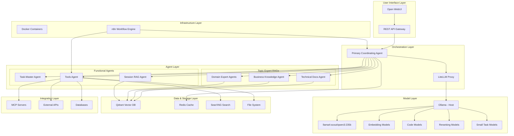
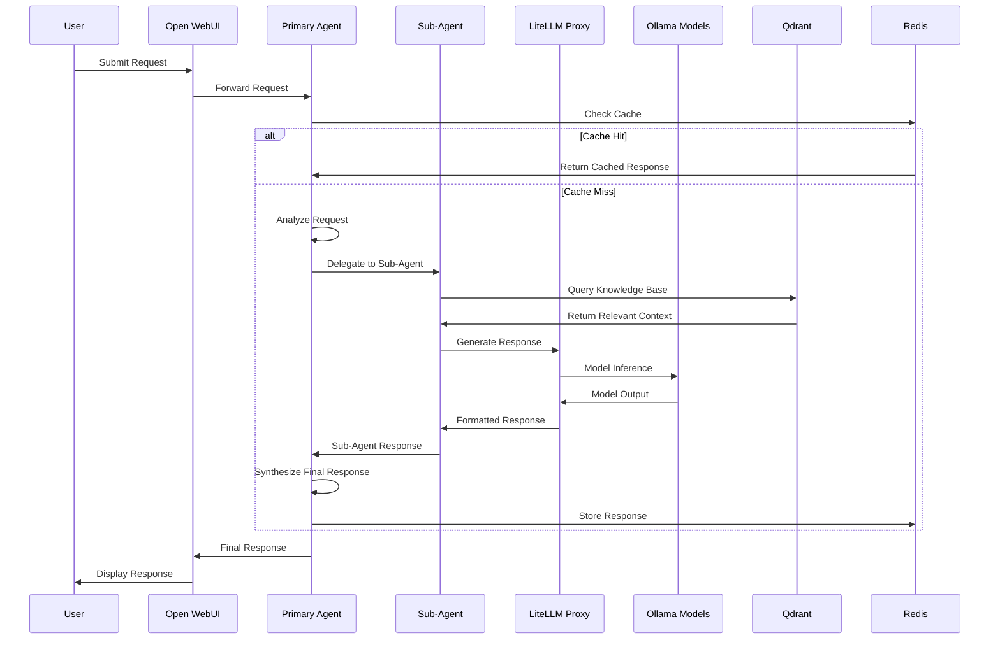

# Local Agentic AI System Architecture Document

## Table of Contents
1. [Executive Summary](#executive-summary)
2. [System Architecture Overview](#system-architecture-overview)
3. [Component Specifications](#component-specifications)
4. [Agent Hierarchy Design](#agent-hierarchy-design)
5. [Data Flow and Communication Patterns](#data-flow-and-communication-patterns)
6. [Implementation Challenges and Roadblocks](#implementation-challenges-and-roadblocks)
7. [Architecture Improvement Suggestions](#architecture-improvement-suggestions)
8. [High-Level Implementation Plan](#high-level-implementation-plan)
9. [Performance and Scalability Considerations](#performance-and-scalability-considerations)
10. [Security and Privacy Considerations](#security-and-privacy-considerations)
11. [Monitoring and Maintenance](#monitoring-and-maintenance)

---

## 1. Executive Summary

### 1.1 System Overview
The Local Agentic AI system is a comprehensive, self-hosted artificial intelligence platform designed to provide intelligent automation and knowledge management capabilities without relying on external paid services. The system leverages a hierarchical agent architecture with a primary coordinating agent managing specialized sub-agents for different domains and tasks.

### 1.2 Key Objectives
- **Privacy-First Design**: Complete local deployment ensuring data sovereignty and privacy
- **Hierarchical Intelligence**: Multi-layered agent system with specialized capabilities
- **Scalable Architecture**: Support for 4-20 concurrent users with extensible design
- **Cost-Effective Operation**: Minimal reliance on paid external services
- **High Accuracy**: Prioritizing response quality over speed

### 1.3 Core Value Proposition
The system provides enterprise-grade AI capabilities through a locally-hosted infrastructure that combines large language models, vector databases, workflow automation, and intelligent routing to deliver contextually-aware responses while maintaining complete data control.

### 1.4 Target Hardware
- **Host**: Mac Studio with 256GB unified memory
- **Primary Models**: llama4:scout or qwen3:235b-a22b via Ollama
- **Supporting Models**: Specialized embedding, code generation, reranking, and lightweight task models

---

## 2. System Architecture Overview

### 2.1 High-Level Architecture Diagram



### 2.2 Architecture Principles

#### 2.2.1 Hierarchical Design
- **Single Point of Control**: Primary coordinating agent manages all user interactions
- **Specialized Sub-Agents**: Domain-specific agents with focused capabilities and limited context
- **Intelligent Routing**: Dynamic delegation based on request analysis and agent capabilities

#### 2.2.2 Modular Components
- **Containerized Services**: All components except Ollama run in Docker containers
- **Loose Coupling**: Components communicate via well-defined APIs and message queues
- **Pluggable Architecture**: Easy addition/removal of agents and services

#### 2.2.3 Local-First Approach
- **Data Sovereignty**: All processing and storage occurs locally
- **Minimal External Dependencies**: Only essential external services (weather, news APIs)
- **Offline Capability**: Core functionality available without internet connectivity

---

## 3. Component Specifications

### 3.1 Ollama (Host-Based Model Server)

#### 3.1.1 Configuration
- **Deployment**: Direct installation on Mac Studio host
- **Memory Allocation**: 80% of unified memory (~205GB) for model execution
- **Environment Variables**:
  ```bash
  OLLAMA_FLASH_ATTENTION=1
  OLLAMA_KV_CACHE_TYPE="q8_0"
  OLLAMA_MAX_LOADED_MODELS=2
  OLLAMA_NUM_PARALLEL=4
  OLLAMA_GPU_PERCENT="80"
  ```

#### 3.1.2 Model Configuration
- **Primary Models**: 
  - llama4:scout (reasoning and coordination)
  - qwen3:235b-a22b (specialized tasks)
- **Supporting Models**:
  - nomic-embed-text (embeddings)
  - codellama:13b (code generation)
  - bge-reranker-large (result reranking)
  - llama3.2:3b (lightweight tasks)

#### 3.1.3 Performance Optimization
- **Flash Attention**: Enabled for reduced memory usage
- **K/V Cache Quantization**: 8-bit quantization for 50% cache reduction
- **Memory Mapping**: Efficient model loading and context management

### 3.2 LiteLLM Proxy

#### 3.2.1 Purpose
- **Model Abstraction**: Unified API interface for all models
- **Load Balancing**: Intelligent request distribution
- **Caching**: Redis-backed response caching
- **Rate Limiting**: Request throttling and queue management

#### 3.2.2 Configuration
```yaml
model_list:
  - model_name: primary-reasoning
    litellm_params:
      model: ollama/llama4:scout
      api_base: http://host.docker.internal:11434
  - model_name: specialized-tasks
    litellm_params:
      model: ollama/qwen3:235b-a22b
      api_base: http://host.docker.internal:11434

litellm_settings:
  cache: true
  cache_params:
    type: redis
    host: redis
    port: 6379
    ttl: 3600
    namespace: "litellm.cache"
```

### 3.3 n8n Workflow Engine

#### 3.3.1 Architecture
- **Queue Mode**: Separate worker containers for scalability
- **Database**: PostgreSQL for workflow persistence
- **Redis Integration**: Queue management and caching

#### 3.3.2 Docker Compose Configuration
```yaml
services:
  n8n:
    image: docker.n8n.io/n8nio/n8n:latest
    environment:
      - QUEUE_MODE=redis
      - EXECUTIONS_PROCESS=main
      - DB_TYPE=postgresdb
    ports:
      - "5678:5678"
    
  n8n-worker:
    image: docker.n8n.io/n8nio/n8n:latest
    environment:
      - QUEUE_MODE=redis
      - EXECUTIONS_PROCESS=worker
```

#### 3.3.3 Agent Workflows
- **Primary Agent Coordination**: Main workflow for request routing
- **Sub-Agent Execution**: Specialized workflows for each agent type
- **Integration Workflows**: MCP server and external API interactions

### 3.4 Qdrant Vector Database

#### 3.4.1 Performance Configuration
```yaml
optimizer:
  default_segment_number: 2
  memmap_threshold: 1_000_000
  indexing_threshold: 20_000
  flush_interval_sec: 5
  max_optimization_threads: 4

hnsw:
  m: 16
  ef_construct: 100
  full_scan_threshold: 10_000
```

#### 3.4.2 Collections Structure
- **Technical Documentation**: Engineering docs, API references, code examples
- **Business Knowledge**: Policies, procedures, domain expertise
- **Session Context**: Temporary collections for conversation context
- **Tool Documentation**: MCP server specs, API documentation

#### 3.4.3 Expected Performance
- **Latency**: 1-2ms per query for 512-dimensional vectors
- **Throughput**: 10,000-15,000 QPS with 8-thread configuration
- **Memory Usage**: ~6GB for 1M vectors (512-dim) including HNSW graph

### 3.5 Redis Cache

#### 3.5.1 Use Cases
- **LLM Response Caching**: Reduce redundant model calls
- **Session Management**: User context and conversation state
- **Queue Management**: n8n workflow queues
- **Rate Limiting**: Request throttling data

#### 3.5.2 Configuration
```yaml
redis:
  image: redis:7-alpine
  command: redis-server --maxmemory 8gb --maxmemory-policy allkeys-lru
  volumes:
    - redis-data:/data
```

### 3.6 SearXNG Local Search

#### 3.6.1 Configuration
```yaml
searxng:
  image: searxng/searxng:latest
  environment:
    - SEARXNG_REDIS_URL=redis://redis:6379/1
    - UWSGI_WORKERS=4
    - UWSGI_THREADS=2
  ports:
    - "8080:8080"
```

#### 3.6.2 Search Engines
- **Web Search**: Google, Bing, DuckDuckGo
- **Academic**: arXiv, Google Scholar
- **Code**: GitHub, Stack Overflow
- **News**: Multiple news sources

### 3.7 Open WebUI

#### 3.7.1 Features
- **Multi-Model Support**: Interface for all available models
- **Conversation Management**: Persistent chat history
- **File Upload**: Document processing and analysis
- **Plugin System**: Custom integrations and tools

#### 3.7.2 Configuration
```yaml
open-webui:
  image: ghcr.io/open-webui/open-webui:main
  environment:
    - OLLAMA_BASE_URL=http://host.docker.internal:11434
    - WEBUI_SECRET_KEY=${WEBUI_SECRET_KEY}
  ports:
    - "3000:8080"
  volumes:
    - open-webui:/app/backend/data
```

---

## 4. Agent Hierarchy Design

### 4.1 Primary Coordinating Agent

#### 4.1.1 Responsibilities
- **Request Analysis**: Understanding user intent and context
- **Agent Selection**: Choosing appropriate sub-agents for tasks
- **Response Synthesis**: Combining sub-agent outputs into coherent responses
- **Context Management**: Maintaining conversation state and history
- **Quality Control**: Validating and refining responses

#### 4.1.2 Decision Matrix
```
Request Type          → Primary Agent → Sub-Agent(s)
Technical Question    → Analysis      → Technical Docs Agent
Business Query        → Analysis      → Business Knowledge Agent
Complex Task          → Decomposition → Task-Master Agent
Tool Operation        → Routing       → Tools Agent
Multi-Domain          → Orchestration → Multiple Agents
```

#### 4.1.3 Model Configuration
- **Primary Model**: llama4:scout (reasoning and coordination)
- **Context Window**: 32K tokens for conversation history
- **Temperature**: 0.3 for consistent decision-making
- **System Prompt**: Comprehensive instructions for agent coordination

### 4.2 Topic Expert RAG Agents

#### 4.2.1 Technical Documentation Agent
- **Knowledge Base**: API documentation, technical specifications, code examples
- **Vector Collections**: 
  - `tech-docs-general`: General technical documentation
  - `tech-docs-apis`: API references and examples
  - `tech-docs-code`: Code snippets and implementations
- **Specialization**: Programming languages, frameworks, system architecture
- **Context Limit**: 8K tokens focused on technical accuracy

#### 4.2.2 Business Knowledge Agent
- **Knowledge Base**: Company policies, procedures, business processes
- **Vector Collections**:
  - `business-policies`: Organizational policies and guidelines
  - `business-processes`: Workflow and procedure documentation
  - `business-domain`: Industry-specific knowledge
- **Specialization**: Business rules, compliance, organizational knowledge
- **Context Limit**: 8K tokens focused on business context

#### 4.2.3 Domain Expert Agents (Extensible)
- **Modular Design**: Easy addition of new domain experts
- **Specialized Collections**: Domain-specific vector stores
- **Custom Prompts**: Tailored system prompts for each domain
- **Examples**: Legal, Medical, Financial, Scientific domains

### 4.3 Task-Master Agent

#### 4.3.1 Capabilities
- **Task Decomposition**: Breaking complex requests into manageable subtasks
- **Workflow Planning**: Creating execution sequences for multi-step tasks
- **Resource Allocation**: Determining required tools and agents
- **Progress Tracking**: Monitoring task completion and dependencies

#### 4.3.2 Task Types
- **Sequential Tasks**: Step-by-step execution with dependencies
- **Parallel Tasks**: Concurrent execution of independent subtasks
- **Conditional Tasks**: Branching logic based on intermediate results
- **Iterative Tasks**: Loops and refinement processes

### 4.4 Tools Agent

#### 4.4.1 Integration Categories
- **File System Operations**: Reading, writing, searching files
- **Database Interactions**: SQL queries, data retrieval and updates
- **Web APIs**: REST/GraphQL API calls and data processing
- **MCP Servers**: Model Context Protocol integrations
- **Search Operations**: SearXNG integration for web search

#### 4.4.2 Tool Registry
```yaml
tools:
  filesystem:
    - read_file
    - write_file
    - search_files
    - list_directory
  
  database:
    - execute_query
    - fetch_data
    - update_records
  
  web_apis:
    - http_request
    - parse_response
    - handle_auth
  
  search:
    - web_search
    - academic_search
    - code_search
```

### 4.5 Session RAG Agent

#### 4.5.1 Purpose
- **Temporary Knowledge**: Session-specific information and context
- **Dynamic Collections**: Created and destroyed per conversation
- **Document Processing**: Uploaded files and temporary references
- **Context Expansion**: Extending conversation memory beyond token limits

#### 4.5.2 Lifecycle Management
- **Creation**: Triggered by document uploads or complex conversations
- **Population**: Automatic ingestion of relevant content
- **Utilization**: Queried by other agents for session context
- **Cleanup**: Automatic deletion after session timeout

---

## 5. Data Flow and Communication Patterns

### 5.1 Request Processing Flow

#### 5.1.1 User Request Ingestion
```
User Input → Open WebUI → REST API → Primary Coordinating Agent
```

#### 5.1.2 Agent Coordination Flow


### 5.2 Inter-Agent Communication

#### 5.2.1 Message Format
```json
{
  "request_id": "uuid",
  "source_agent": "primary_coordinator",
  "target_agent": "technical_docs",
  "message_type": "query",
  "payload": {
    "query": "user question",
    "context": "conversation context",
    "constraints": {
      "max_tokens": 8192,
      "temperature": 0.3
    }
  },
  "metadata": {
    "timestamp": "2025-07-29T10:00:00Z",
    "priority": "normal",
    "timeout": 30
  }
}
```

#### 5.2.2 Response Format
```json
{
  "request_id": "uuid",
  "source_agent": "technical_docs",
  "target_agent": "primary_coordinator",
  "message_type": "response",
  "payload": {
    "response": "agent response",
    "confidence": 0.85,
    "sources": ["doc1.md", "api_ref.json"],
    "metadata": {
      "processing_time": 1.2,
      "tokens_used": 1024
    }
  },
  "status": "success"
}
```

### 5.3 Data Storage Patterns

#### 5.3.1 Vector Database Organization
```
qdrant/
├── collections/
│   ├── tech-docs-general/
│   ├── tech-docs-apis/
│   ├── business-policies/
│   ├── business-processes/
│   └── session-{uuid}/
├── snapshots/
└── config/
```

#### 5.3.2 Redis Key Patterns
```
litellm:cache:{model}:{hash}     # LLM response cache
session:{user_id}:{session_id}   # User session data
agent:state:{agent_id}           # Agent state information
queue:n8n:{workflow_id}          # n8n workflow queues
rate_limit:{user_id}             # Rate limiting data
```

### 5.4 Error Handling and Fallbacks

#### 5.4.1 Agent Failure Handling
- **Timeout Management**: 30-second timeout for sub-agent responses
- **Fallback Agents**: Alternative agents for critical functions
- **Graceful Degradation**: Reduced functionality when components fail
- **Error Propagation**: Structured error reporting to primary agent

#### 5.4.2 Model Failure Handling
- **Model Switching**: Automatic fallback to alternative models
- **Queue Management**: Request queuing during model unavailability
- **Health Monitoring**: Continuous model health checks
- **Load Balancing**: Distribution across available model instances

---

## 6. Implementation Challenges and Roadblocks

### 6.1 Technical Challenges

#### 6.1.1 Memory Management
**Challenge**: Efficiently managing 256GB unified memory across multiple large models and vector databases.

**Potential Issues**:
- Model loading conflicts and memory fragmentation
- Qdrant memory usage scaling with vector collections
- Redis memory pressure under high load
- Ollama model switching overhead

**Mitigation Strategies**:
- Implement intelligent model loading/unloading based on usage patterns
- Use Qdrant's memory mapping for large collections
- Configure Redis with appropriate eviction policies
- Monitor memory usage with automated alerts

#### 6.1.2 Agent Coordination Complexity
**Challenge**: Ensuring reliable communication and coordination between multiple agents.

**Potential Issues**:
- Circular dependencies between agents
- Context loss during agent handoffs
- Inconsistent response quality across agents
- Deadlocks in complex multi-agent workflows

**Mitigation Strategies**:
- Implement strict agent hierarchy with clear communication protocols
- Use structured message formats with comprehensive metadata
- Establish timeout mechanisms and fallback procedures
- Design stateless agents where possible

#### 6.1.3 Vector Database Performance
**Challenge**: Maintaining sub-second query performance as knowledge bases grow.

**Potential Issues**:
- Index rebuild times affecting availability
- Memory pressure from large HNSW graphs
- Query performance degradation with collection size
- Concurrent access bottlenecks

**Mitigation Strategies**:
- Implement incremental indexing strategies
- Use collection sharding for large datasets
- Optimize HNSW parameters for use case
- Implement query result caching

### 6.2 Architectural Challenges

#### 6.2.1 Context Window Limitations
**Challenge**: Managing context across multiple agents with limited token windows.

**Potential Issues**:
- Context truncation losing important information
- Inconsistent context between agents
- Expensive context reconstruction
- Memory overhead from context management

**Solutions**:
- Implement hierarchical context summarization
- Use vector similarity for context relevance ranking
- Design context-aware agent communication protocols
- Leverage Redis for efficient context caching

#### 6.2.2 Model Selection and Routing
**Challenge**: Intelligently routing requests to appropriate models and agents.

**Potential Issues**:
- Suboptimal model selection reducing response quality
- Load imbalance across models
- Complex routing logic maintenance
- Performance overhead from routing decisions

**Solutions**:
- Develop machine learning-based routing algorithms
- Implement A/B testing for routing strategies
- Create comprehensive model capability matrices
- Use performance metrics for dynamic routing adjustment

### 6.3 Operational Challenges

#### 6.3.1 Container Orchestration
**Challenge**: Managing complex multi-container deployment with dependencies.

**Potential Issues**:
- Service startup order dependencies
- Network connectivity between containers
- Volume mounting and persistence
- Resource allocation conflicts

**Solutions**:
- Use Docker Compose with proper dependency management
- Implement health checks and readiness probes
- Design containers for graceful startup/shutdown
- Use named volumes for data persistence

#### 6.3.2 Model Updates and Versioning
**Challenge**: Updating models without service disruption.

**Potential Issues**:
- Model compatibility breaking changes
- Downtime during model updates
- Version synchronization across components
- Rollback complexity

**Solutions**:
- Implement blue-green deployment for models
- Use model versioning and compatibility checks
- Design backward-compatible agent interfaces
- Automate rollback procedures

---

## 7. Architecture Improvement Suggestions

### 7.1 Performance Optimizations

#### 7.1.1 Intelligent Caching Strategy
**Current State**: Basic Redis caching for LLM responses
**Improvement**: Multi-layer caching with semantic similarity

**Implementation**:
- **L1 Cache**: Exact query matches in Redis
- **L2 Cache**: Semantic similarity cache using vector embeddings
- **L3 Cache**: Precomputed responses for common queries
- **Cache Warming**: Proactive caching of likely queries

**Benefits**:
- Reduced model inference costs
- Improved response times
- Better resource utilization

#### 7.1.2 Dynamic Model Loading
**Current State**: Static model loading configuration
**Improvement**: Demand-based model loading with usage prediction

**Implementation**:
- Usage pattern analysis for model selection
- Predictive model loading based on user behavior
- Automatic model unloading during low usage periods
- Model warm-up strategies for peak times

**Benefits**:
- Optimal memory utilization
- Reduced model switching latency
- Improved system responsiveness

### 7.2 Scalability Enhancements

#### 7.2.1 Horizontal Agent Scaling
**Current State**: Single instance per agent type
**Improvement**: Multiple instances with load balancing

**Implementation**:
- Agent instance pools with automatic scaling
- Load balancing based on agent specialization
- Request queuing and priority management
- Health monitoring and automatic recovery

**Benefits**:
- Higher concurrent user support
- Improved fault tolerance
- Better resource distribution

#### 7.2.2 Federated Vector Databases
**Current State**: Single Qdrant instance
**Improvement**: Distributed vector database cluster

**Implementation**:
- Collection sharding across multiple Qdrant nodes
- Automatic replication for high availability
- Query routing based on collection affinity
- Consistent hashing for data distribution

**Benefits**:
- Improved query performance
- Higher storage capacity
- Better fault tolerance

### 7.3 Intelligence Improvements

#### 7.3.1 Adaptive Agent Selection
**Current State**: Rule-based agent routing
**Improvement**: Machine learning-based agent selection

**Implementation**:
- Training data from successful agent selections
- Reinforcement learning for routing optimization
- Context-aware agent capability assessment
- Performance feedback integration

**Benefits**:
- More accurate agent selection
- Improved response quality
- Reduced processing overhead

#### 7.3.2 Continuous Learning System
**Current State**: Static knowledge bases
**Improvement**: Dynamic knowledge base updates

**Implementation**:
- Automatic document ingestion pipelines
- Quality assessment for new knowledge
- Incremental vector database updates
- Knowledge conflict resolution

**Benefits**:
- Always up-to-date information
- Reduced manual maintenance
- Improved accuracy over time

### 7.4 User Experience Enhancements

#### 7.4.1 Personalized Agent Behavior
**Current State**: Generic agent responses
**Improvement**: User-specific agent customization

**Implementation**:
- User preference learning and storage
- Personalized response formatting
- Custom agent personality settings
- Individual knowledge base extensions

**Benefits**:
- More relevant responses
- Improved user satisfaction
- Better task completion rates

#### 7.4.2 Advanced Context Management
**Current State**: Basic conversation history
**Improvement**: Sophisticated context understanding

**Implementation**:
- Multi-turn conversation analysis
- Context importance scoring
- Automatic context summarization
- Cross-session context persistence

**Benefits**:
- Better conversation continuity
- More contextually aware responses
- Improved long-term interactions

---

## 8. High-Level Implementation Plan

### 8.1 Phase 1: Foundation Infrastructure (Weeks 1-4)

#### 8.1.1 Core Infrastructure Setup
**Week 1-2: Base System Configuration**
- Mac Studio optimization for AI workloads
- Ollama installation and model deployment
- Docker environment setup and configuration
- Basic networking and security configuration

**Week 3-4: Core Services Deployment**
- Redis deployment and configuration
- Qdrant vector database setup
- PostgreSQL database for n8n
- Basic monitoring and logging setup

**Deliverables**:
- Fully configured Mac Studio host
- Running core infrastructure services
- Basic monitoring dashboard
- Infrastructure documentation

#### 8.1.2 Model Integration
**Tasks**:
- Download and configure primary models (llama4:scout, qwen3:235b-a22b)
- Set up embedding and specialized models
- Configure LiteLLM proxy with model routing
- Performance testing and optimization

**Success Criteria**:
- All models responding within acceptable latency
- LiteLLM proxy successfully routing requests
- Memory usage within expected parameters
- Basic model health monitoring active

### 8.2 Phase 2: Agent Framework Development (Weeks 5-8)

#### 8.2.1 Primary Coordinating Agent
**Week 5-6: Core Agent Development**
- Primary agent architecture and communication protocols
- Request analysis and routing logic
- Basic response synthesis capabilities
- Integration with LiteLLM proxy

**Week 7-8: Agent Coordination**
- Sub-agent communication framework
- Message queuing and timeout handling
- Error handling and fallback mechanisms
- Basic agent state management

**Deliverables**:
- Functional primary coordinating agent
- Agent communication framework
- Basic request routing capabilities
- Error handling and recovery mechanisms

#### 8.2.2 n8n Workflow Integration
**Tasks**:
- n8n deployment with queue mode
- Workflow templates for agent coordination
- Integration with Redis and PostgreSQL
- Custom nodes for agent communication

**Success Criteria**:
- n8n successfully orchestrating agent workflows
- Reliable message passing between agents
- Workflow persistence and recovery
- Performance monitoring for workflows

### 8.3 Phase 3: Specialized Agents Implementation (Weeks 9-12)

#### 8.3.1 Topic Expert RAG Agents
**Week 9-10: Technical Documentation Agent**
- Vector database collection setup
- Document ingestion pipeline
- RAG query and response generation
- Integration with primary agent

**Week 11-12: Business Knowledge Agent**
- Business knowledge collection creation
- Policy and procedure document processing
- Business-specific response formatting
- Testing and optimization

**Deliverables**:
- Functional technical documentation agent
- Business knowledge agent with sample data
- Document ingestion and processing pipelines
- RAG query performance optimization

#### 8.3.2 Task-Master and Tools Agents
**Tasks**:
- Task decomposition logic implementation
- Tools registry and integration framework
- MCP server integration setup
- File system and database tool implementations

**Success Criteria**:
- Task-Master successfully breaking down complex requests
- Tools agent executing basic operations
- MCP server integrations functional
- Comprehensive tool testing completed

### 8.4 Phase 4: User Interface and Integration (Weeks 13-16)

#### 8.4.1 Open WebUI Deployment
**Week 13-14: UI Setup and Configuration**
- Open WebUI deployment and configuration
- Integration with LiteLLM proxy
- User authentication and session management
- Basic conversation interface testing

**Week 15-16: Advanced Features**
- File upload and processing capabilities
- Multi-model selection interface
- Conversation history and management
- User preference settings

**Deliverables**:
- Fully functional web interface
- User authentication system
- File processing capabilities
- Comprehensive user documentation

#### 8.4.2 SearXNG Integration
**Tasks**:
- SearXNG deployment and configuration
- Integration with Tools agent
- Search result processing and formatting
- Performance optimization

**Success Criteria**:
- SearXNG providing relevant search results
- Seamless integration with agent workflows
- Acceptable search response times
- Comprehensive search source coverage

### 8.5 Phase 5: Testing and Optimization (Weeks 17-20)

#### 8.5.1 System Integration Testing
**Week 17-18: End-to-End Testing**
- Complete user workflow testing
- Multi-agent coordination validation
- Performance benchmarking
- Error scenario testing

**Week 19-20: Optimization and Tuning**
- Performance bottleneck identification
- Memory usage optimization
- Response time improvements
- Scalability testing

**Deliverables**:
- Comprehensive test suite
- Performance benchmarking results
- Optimization recommendations
- System tuning documentation

#### 8.5.2 User Acceptance Testing
**Tasks**:
- User interface usability testing
- Response quality evaluation
- Concurrent user testing
- Documentation review and updates

**Success Criteria**:
- System meeting all performance requirements
- User satisfaction with response quality
- Successful concurrent user handling
- Complete system documentation

### 8.6 Phase 6: Production Deployment (Weeks 21-24)

#### 8.6.1 Production Hardening
**Week 21-22: Security and Monitoring**
- Security audit and hardening
- Comprehensive monitoring setup
- Backup and recovery procedures
- Disaster recovery planning

**Week 23-24: Final Deployment**
- Production environment setup
- Data migration and validation
- User training and onboarding
- Go-live support and monitoring

**Deliverables**:
- Production-ready system
- Security audit report
- Monitoring and alerting system
- User training materials
- Operational runbooks

---

## 9. Performance and Scalability Considerations

### 9.1 Performance Targets

#### 9.1.1 Response Time Requirements
- **Simple Queries**: < 2 seconds end-to-end
- **Complex Multi-Agent Tasks**: < 10 seconds
- **RAG Queries**: < 3 seconds including vector search
- **Tool Operations**: < 5 seconds for most operations

#### 9.1.2 Throughput Requirements
- **Concurrent Users**: 4 typical, 20 maximum
- **Requests per Minute**: 100 sustained, 300 peak
- **Vector Queries**: 1,000 QPS sustained
- **Cache Hit Rate**: > 70% for repeated queries

#### 9.1.3 Resource Utilization Targets
- **Memory Usage**: < 90% of available 256GB
- **CPU Usage**: < 80% average, < 95% peak
- **Storage I/O**: < 80% of SSD capacity
- **Network Bandwidth**: Minimal external usage

### 9.2 Scalability Architecture

#### 9.2.1 Vertical Scaling Capabilities
**Current Configuration**:
- Mac Studio with 256GB unified memory
- M2 Ultra or M1 Ultra processor
- High-speed SSD storage

**Scaling Strategies**:
- Memory optimization through model quantization
- Efficient model loading and unloading
- Intelligent caching to reduce computation
- Resource monitoring and automatic adjustment

#### 9.2.2 Horizontal Scaling Potential
**Agent Scaling**:
- Multiple instances of specialized agents
- Load balancing across agent instances
- Queue-based request distribution
- Automatic scaling based on demand

**Database Scaling**:
- Qdrant cluster deployment
- Redis cluster for high availability
- Read replicas for query distribution
- Sharding strategies for large datasets

### 9.3 Performance Monitoring

#### 9.3.1 Key Performance Indicators (KPIs)
```yaml
response_metrics:
  - average_response_time
  - 95th_percentile_response_time
  - request_success_rate
  - cache_hit_rate

resource_metrics:
  - memory_utilization
  - cpu_utilization
  - disk_io_utilization
  - network_bandwidth

agent_metrics:
  - agent_response_time
  - agent_success_rate
  - agent_queue_depth
  - agent_error_rate

model_metrics:
  - model_inference_time
  - tokens_per_second
  - model_memory_usage
  - model_availability
```

#### 9.3.2 Monitoring Stack
- **Metrics Collection**: Prometheus with custom exporters
- **Visualization**: Grafana dashboards
- **Alerting**: AlertManager with notification channels
- **Log Aggregation**: ELK stack or similar
- **Health Checks**: Custom health check endpoints

### 9.4 Load Testing Strategy

#### 9.4.1 Test Scenarios
**Scenario 1: Normal Load**
- 4 concurrent users
- Mixed query types (simple, complex, RAG)
- 30-minute sustained test
- Expected: All performance targets met

**Scenario 2: Peak Load**
- 20 concurrent users
- Heavy RAG and multi-agent queries
- 15-minute stress test
- Expected: Graceful degradation, no failures

**Scenario 3: Burst Load**
- Rapid scaling from 1 to 20 users
- Mixed workload with file uploads
- 10-minute burst test
- Expected: System stability maintained

#### 9.4.2 Performance Optimization Cycle
1. **Baseline Measurement**: Establish current performance metrics
2. **Bottleneck Identification**: Identify limiting factors
3. **Optimization Implementation**: Apply targeted improvements
4. **Validation Testing**: Verify improvements
5. **Monitoring**: Continuous performance tracking

---

## 10. Security and Privacy Considerations

### 10.1 Local Deployment Security

#### 10.1.1 Network Security
**Isolation Strategy**:
- All services running on isolated Docker networks
- No external network access except for essential services
- Firewall rules restricting inbound connections
- VPN access for remote administration

**Network Architecture**:
```yaml
networks:
  frontend:
    driver: bridge
    internal: false  # Open WebUI access
  backend:
    driver: bridge
    internal: true   # Internal services only
  database:
    driver: bridge
    internal: true   # Database access only
```

#### 10.1.2 Container Security
**Security Measures**:
- Non-root user execution in all containers
- Read-only root filesystems where possible
- Resource limits to prevent DoS attacks
- Regular security updates for base images

**Container Configuration**:
```yaml
security_opt:
  - no-new-privileges:true
user: "1000:1000"
read_only: true
tmpfs:
  - /tmp:noexec,nosuid,size=100m
```

### 10.2 Data Privacy and Protection

#### 10.2.1 Data Sovereignty
**Local Processing**:
- All AI inference performed locally
- No data transmission to external services
- Local storage for all user data and conversations
- Encrypted storage for sensitive information

**Data Flow Control**:
- Audit logging for all data access
- Data retention policies and automatic cleanup
- User consent management for data processing
- Data anonymization for analytics

#### 10.2.2 Encryption Strategy
**Data at Rest**:
- Full disk encryption on Mac Studio
- Encrypted Docker volumes for sensitive data
- Database encryption for user information
- Secure key management and rotation

**Data in Transit**:
- TLS encryption for all web interfaces
- Encrypted inter-service communication
- Certificate management and renewal
- Secure API authentication

### 10.3 Access Control and Authentication

#### 10.3.1 User Authentication
**Authentication Methods**:
- Local user accounts with strong passwords
- Multi-factor authentication support
- Session management with secure tokens
- Automatic session timeout

**Authorization Framework**:
```yaml
roles:
  admin:
    permissions:
      - system_configuration
      - user_management
      - model_management
  user:
    permissions:
      - chat_interface
      - file_upload
      - conversation_history
  readonly:
    permissions:
      - view_conversations
      - basic_queries
```

#### 10.3.2 Service Authentication
**Inter-Service Security**:
- API keys for service-to-service communication
- JWT tokens for session management
- Rate limiting to prevent abuse
- Request signing for critical operations

### 10.4 Audit and Compliance

#### 10.4.1 Audit Logging
**Logged Events**:
- User authentication and authorization
- Data access and modification
- System configuration changes
- Error conditions and security events

**Log Management**:
- Centralized logging with structured formats
- Log retention policies
- Log integrity protection
- Automated log analysis and alerting

#### 10.4.2 Privacy Compliance
**Data Protection Measures**:
- User data minimization principles
- Right to data deletion implementation
- Data portability features
- Privacy impact assessments

**Compliance Framework**:
- GDPR compliance for EU users
- Data processing transparency
- User consent management
- Regular privacy audits

---

## 11. Monitoring and Maintenance

### 11.1 System Monitoring

#### 11.1.1 Infrastructure Monitoring
**Host System Metrics**:
- CPU utilization and temperature
- Memory usage and swap activity
- Disk I/O and storage capacity
- Network bandwidth and connectivity

**Container Metrics**:
- Container resource usage
- Container health and availability
- Image vulnerability scanning
- Container restart frequency

#### 11.1.2 Application Monitoring
**Agent Performance**:
- Response times per agent type
- Success rates and error frequencies
- Queue depths and processing times
- Resource consumption per agent

**Model Performance**:
- Inference latency and throughput
- Model memory usage
- Token processing rates
- Model availability and health

### 11.2 Alerting Strategy

#### 11.2.1 Critical Alerts
**System-Level Alerts**:
- Memory usage > 95%
- CPU temperature > 85°C
- Disk space < 10% free
- Service unavailability > 1 minute

**Application-Level Alerts**:
- Response time > 10 seconds
- Error rate > 5%
- Queue depth > 100 requests
- Model inference failures

#### 11.2.2 Alert Management
**Notification Channels**:
- Email notifications for critical issues
- Slack/Discord integration for team alerts
- SMS for emergency situations
- Dashboard notifications for warnings

**Alert Escalation**:
- Immediate notification for critical issues
- 5-minute escalation for unacknowledged alerts
- Automatic ticket creation for persistent issues
- Weekly alert summary reports

### 11.3 Maintenance Procedures

#### 11.3.1 Routine Maintenance
**Daily Tasks**:
- System health check verification
- Log file rotation and cleanup
- Backup verification
- Performance metric review

**Weekly Tasks**:
- Security update installation
- Database optimization and cleanup
- Model performance analysis
- Capacity planning review

**Monthly Tasks**:
- Full system backup and restore test
- Security audit and vulnerability scan
- Performance benchmarking
- Documentation updates

#### 11.3.2 Update Management
**Model Updates**:
- Staged deployment with rollback capability
- Performance testing before production
- Compatibility verification
- User notification of changes

**System Updates**:
- Security patch prioritization
- Scheduled maintenance windows
- Change management process
- Rollback procedures

### 11.4 Backup and Recovery

#### 11.4.1 Backup Strategy
**Data Backup**:
- Daily incremental backups
- Weekly full system backups
- Real-time replication for critical data
- Offsite backup storage

**Configuration Backup**:
- Version-controlled configuration files
- Docker image registry backups
- Database schema and data backups
- Certificate and key backups

#### 11.4.2 Disaster Recovery
**Recovery Procedures**:
- Documented recovery processes
- Regular recovery testing
- Recovery time objectives (RTO): < 4 hours
- Recovery point objectives (RPO): < 1 hour

**Business Continuity**:
- Alternative access methods during outages
- Communication plans for extended downtime
- Data integrity verification procedures
- Service restoration prioritization

### 11.5 Capacity Planning

#### 11.5.1 Growth Projections
**User Growth**:
- Current: 4 typical users
- 6-month target: 8 typical users
- 12-month target: 12 typical users
- Maximum capacity: 20 concurrent users

**Data Growth**:
- Vector database growth: 10% monthly
- Conversation history: 5GB monthly
- Model storage: Stable with periodic updates
- Log data: 1GB monthly

#### 11.5.2 Resource Planning
**Hardware Upgrades**:
- Memory expansion planning
- Storage capacity monitoring
- Network bandwidth assessment
- Cooling and power requirements

**Software Scaling**:
- Agent instance scaling strategies
- Database sharding planning
- Cache optimization opportunities
- Model efficiency improvements

---

## Conclusion

This architecture document provides a comprehensive blueprint for implementing a Local Agentic AI system that meets the specified requirements for privacy, performance, and functionality. The hierarchical agent design, combined with robust infrastructure components, creates a scalable and maintainable platform for intelligent automation and knowledge management.

The implementation plan provides a structured approach to building the system over 24 weeks, with clear milestones and deliverables. The architecture is designed to be extensible, allowing for future enhancements and additional capabilities as requirements evolve.

Key success factors for this implementation include:
- Careful resource management on the Mac Studio platform
- Robust agent coordination and communication protocols
- Comprehensive monitoring and maintenance procedures
- Strong security and privacy protections
- Thorough testing and optimization throughout development

This system will provide a powerful, privacy-preserving AI platform that can serve as a foundation for advanced automation and knowledge management capabilities while maintaining complete local control over data and processing.

---

*Document Version: 1.0*  
*Last Updated: July 29, 2025*  
*Author: AI Architecture Team*
